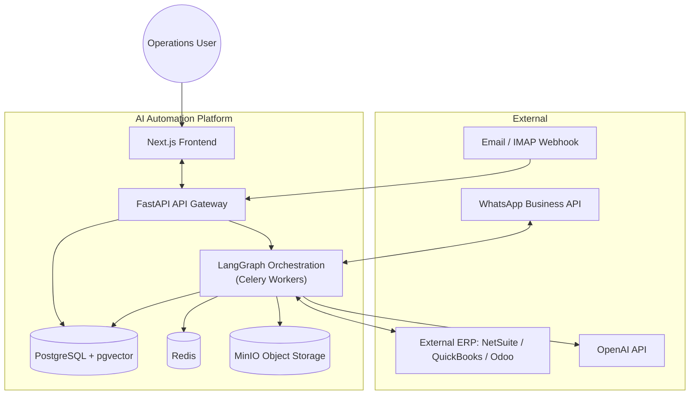
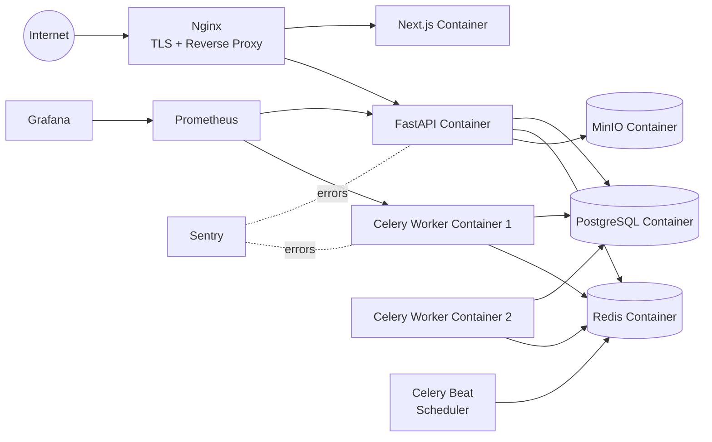
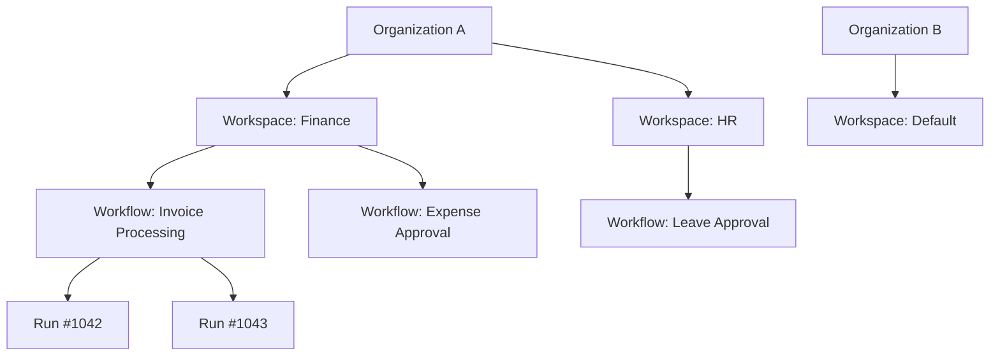

# Volume 1 — Vision, Market Positioning & System Architecture
### AI Automation Platform — *Enterprise AI Workflow Automation Platform*

> **Document status:** Master Blueprint · Volume 1 of 7
> **Audience:** Founders, Principal Engineers, Investors, Contributing Engineers
> **Companion volumes:** Backend Architecture (Vol. 2) · Frontend Architecture (Vol. 3) · AI Engineering (Vol. 4) · ERP Automation (Vol. 5) · Deployment & Ops (Vol. 6) · Roadmap & GTM (Vol. 7)

---

## Table of Contents

1. [Executive Summary](#1-executive-summary)
2. [Vision & Mission](#2-vision--mission)
3. [Business Problem](#3-business-problem)
4. [Business Value](#4-business-value)
5. [Competitor Analysis](#5-competitor-analysis)
6. [Target Audience](#6-target-audience)
7. [Market Positioning](#7-market-positioning)
8. [Unique Selling Points](#8-unique-selling-points)
9. [Technology Selection](#9-technology-selection--rationale)
10. [Overall System Architecture](#10-overall-system-architecture)
11. [High-Level Diagrams](#11-high-level-diagrams)
12. [Repository & Folder Structure](#12-repository--folder-structure)
13. [Development Principles](#13-development-principles)

---

## 1. Executive Summary

**AI Automation Platform (AAP)** is a multi-tenant SaaS that lets finance, operations, HR, and sales teams build, run, and monitor AI-driven business workflows through a visual, node-based builder — without writing code. Under the hood, every workflow compiles down to a **LangGraph** state machine, giving each automation the reliability properties (checkpointing, retries, human-in-the-loop interrupts, replayable state) that ad-hoc "prompt chaining" tools cannot offer.

The platform's first wedge is **ERP-adjacent document workflows** — invoice extraction, vendor onboarding, expense approval, journal entry validation — because these are high-volume, rule-heavy, and currently the most expensive manual processes inside mid-market finance teams. Once a customer trusts AAP with a finance workflow, expansion into HR, sales, and procurement workflows becomes a natural upsell.

This volume defines *why* the product exists, *who* it is for, and *how* the system is architected at the highest level. Implementation detail begins in Volume 2.

---

## 2. Vision & Mission

### 2.1 Vision

> *A world where every repetitive business decision — approve, reject, extract, classify, notify — is handled by an auditable AI agent that a non-technical operations lead can build, inspect, and trust in an afternoon.*

### 2.2 Mission

To give mid-market and enterprise operations teams a **visual, governed, observable** way to compose LLM agents and traditional business logic into production workflows — replacing brittle Zapier chains and expensive custom RPA/ERP-consulting engagements with something that is faster to build, cheaper to run, and safe enough for a controller to sign off on.

### 2.3 Why now

| Trend | Implication for AAP |
|---|---|
| LLMs reached reliable structured-output / function-calling quality (GPT-4-class models) | Extraction and classification steps in ERP workflows are now accurate enough to remove humans from the *first pass*, not just assist them. |
| LangGraph / durable-execution graph frameworks matured | Long-running, resumable, human-in-the-loop agent workflows are now an engineering solved problem, not a research problem. |
| SMB/mid-market finance teams are chronically understaffed | Demand for "AI employee" style automation is at an all-time high, and budget authority has shifted from IT to line-of-business owners. |
| No-code automation tools (Zapier, Make) lack governance, audit trails, and agentic reasoning | There is a clear whitespace between "no-code plumbing" and "full RPA/ERP consulting," which AAP occupies. |

---

## 3. Business Problem

Mid-market companies ($10M–$500M revenue) run finance, HR, and sales operations on a patchwork of ERPs (NetSuite, QuickBooks, Odoo, SAP Business One), spreadsheets, email, and WhatsApp/Slack. The result:

- **Manual document processing.** Invoices arrive by email as PDFs; a human reads them, keys them into the ERP, and routes them for approval. This takes 10–20 minutes per invoice and does not scale linearly with headcount cost.
- **No audit trail across tools.** An approval that happens over email or WhatsApp has no structured record for SOX/audit purposes.
- **Automation tools stop at "plumbing."** Zapier/Make can move data between systems but cannot *reason* about a document ("is this vendor already registered? does this expense violate policy? does this journal entry balance?").
- **RPA and ERP consulting are expensive and slow.** A traditional RPA/ERP integration project costs \$50k–\$300k and takes 3–9 months; it is inaccessible to companies below a certain size, and even large enterprises want faster iteration.
- **Compliance risk.** Manual approval chains are error-prone and hard to prove compliant during audits.

## 4. Business Value

| Stakeholder | Value delivered |
|---|---|
| **CFO / Controller** | Faster close, fewer manual keying errors, full audit trail of every AI decision and human approval. |
| **AP/AR team** | Invoices auto-extracted, matched, and routed; humans only touch exceptions. |
| **HR Ops** | Leave, payroll, and attendance exceptions triaged automatically with policy-aware agents. |
| **Sales Ops** | Quotation and CRM data entry automated from inbound email/chat. |
| **IT / Platform team** | One governed platform instead of dozens of unmanaged Zapier zaps and one-off scripts. |
| **AI/Automation agencies (channel)** | A white-label-able platform to deliver client automations in days instead of months. |

**Quantified value (illustrative, mid-market AP use case):**

| Metric | Manual process | With AAP | Delta |
|---|---|---|---|
| Time per invoice | 12–18 min | 1–2 min (exception only) | ~90% reduction |
| Cost per invoice (fully loaded labor) | $3.50–$6.00 | $0.30–$0.60 (compute + review) | ~85–90% reduction |
| Time-to-approval (SLA) | 2–5 business days | Same day (auto-routed) | 3–5x faster |
| Audit prep time (quarterly) | 3–5 days | <1 day (native audit log) | ~80% reduction |

---

## 5. Competitor Analysis

| Category | Examples | Strengths | Weaknesses vs. AAP |
|---|---|---|---|
| No-code automation | Zapier, Make, n8n | Huge integration catalogs, easy to start | No native agentic reasoning, weak governance/audit, not built for regulated finance workflows |
| RPA platforms | UiPath, Automation Anywhere | Enterprise trust, deep desktop automation | Expensive, slow to implement, brittle to UI changes, not LLM-native |
| Agent frameworks (dev tools) | LangChain, CrewAI, Microsoft AutoGen | Powerful, flexible | Require engineering teams to build the whole product around them; no visual builder, no multi-tenant SaaS layer |
| Vertical AI point-solutions | Ramp/Bill.com (AP automation), Rippling (HR) | Deep in one vertical | Locked to their own ERP/finance stack, not a general workflow builder, cannot be extended with custom agents |
| ERP-native automation | NetSuite SuiteFlow, SAP Workflow | Deep ERP integration | No LLM reasoning, clunky UX, vendor lock-in, expensive customization |

**AAP's whitespace:** the only category combining (a) a **visual, LangGraph-backed workflow builder**, (b) **native agentic/LLM reasoning** with structured tool calls, and (c) **enterprise governance** (RBAC, audit log, human-approval interrupts) in one multi-tenant SaaS product.

---

## 6. Target Audience

**Primary (beachhead):**
- Finance/AP teams at mid-market companies (50–2,000 employees) running QuickBooks/NetSuite/Odoo.
- AI automation agencies and independent consultants building client automations (channel/reseller motion).

**Secondary:**
- HR operations teams (leave, payroll exception handling).
- Sales operations teams (quotation/CRM automation).
- Enterprise IT/platform teams standardizing on one internal automation platform instead of shadow-IT Zapier sprawl.

**Buyer vs. user:**

| Role | Buyer? | User? | Cares most about |
|---|---|---|---|
| CFO / Finance Director | Yes | Rarely | ROI, audit trail, risk reduction |
| Controller / AP Manager | Sometimes | Yes | Exception handling speed, accuracy |
| Automation consultant | Yes (on behalf of client) | Yes | Speed to build, white-label, reusability |
| IT/Platform lead | Sometimes (enterprise) | Rarely | Security, SSO, RBAC, observability |

---

## 7. Market Positioning

```
                     High governance / audit rigor
                                │
        ERP-native workflows   │   AI Automation Platform  ◄── AAP sits here
        (SAP, NetSuite Flow)   │   (this product)
                                │
   Low agentic reasoning ──────┼────────── High agentic reasoning
                                │
        Zapier / Make / n8n    │   Raw agent frameworks
                                │   (LangChain, CrewAI - dev tools only)
                                │
                     Low governance / audit rigor
```

**Positioning statement:**

> For operations and finance leaders at mid-market companies who need document- and approval-heavy workflows automated, **AI Automation Platform** is a visual workflow builder with native AI agents that is more governed than no-code tools and faster to deploy than RPA or ERP consulting — unlike Zapier or UiPath, it reasons over unstructured documents and enforces policy the way a trained employee would.

---

## 8. Unique Selling Points

1. **LangGraph-native execution engine** — every workflow is a real, resumable state graph (not a linear "trigger → action" chain), enabling parallel branches, conditional routing, retries, and human-approval interrupts out of the box.
2. **Visual builder that produces production-grade agents** — drag-and-drop nodes compile to typed, versioned, testable graph definitions; no "black box no-code" lock-in.
3. **ERP-aware node library** — pre-built nodes for invoice extraction, journal validation, vendor matching, and approval routing, informed by real accounting workflows (see Volume 5).
4. **Enterprise governance by default** — RBAC, audit logs, per-organization API keys, and full replayable execution history ship in v1, not as an enterprise add-on bolted on later.
5. **Full cost and observability transparency** — token-level cost dashboard, OpenTelemetry tracing, and LangSmith evaluation integration so teams can see *exactly* what an agent did and what it cost.
6. **Composable knowledge base** — pgvector-backed RAG with hybrid search, shared across workflows, so agents get smarter as the org uses the platform more.

---

## 9. Technology Selection & Rationale

The stack was chosen against three criteria: **(1) production-readiness** (battle-tested, not bleeding-edge), **(2) LLM/agent-native fit**, and **(3) team velocity** for a small engineering team shipping fast.

### 9.1 Backend

| Technology | Why chosen | Primary alternative considered | Why not chosen |
|---|---|---|---|
| **Python + FastAPI** | Async-first, best-in-class typing (Pydantic), the native language of the AI/agent ecosystem (LangChain/LangGraph, OpenAI SDK). | Node.js + NestJS | Weaker AI-ecosystem tooling; would require a second runtime alongside Python for agent execution. |
| **LangGraph** | Purpose-built for durable, resumable, human-in-the-loop agent state machines with first-class checkpointing. | Plain LangChain chains / custom orchestration | Chains are linear and not resumable; a hand-rolled orchestrator would re-invent checkpointing, retries, and interrupts. |
| **LangChain (selectively)** | Reused for model-agnostic wrappers, document loaders, and text splitters where LangGraph doesn't need to own the abstraction. | Raw OpenAI SDK everywhere | Loses model portability and pre-built RAG utilities; acceptable trade-off only for hot paths (see Vol. 4 §3). |
| **PostgreSQL + pgvector** | One database for relational + vector data avoids operating a second specialized vector DB for v1 scale. | Dedicated vector DB (Pinecone/Weaviate) | Adds an operational dependency and cost before it's justified by scale; pgvector is sufficient into the tens of millions of vectors. |
| **Redis** | De-facto standard for caching, pub/sub (used for WebSocket fan-out), and Celery broker. | Keeping everything in Postgres (e.g. `pg_cron`, `LISTEN/NOTIFY`) | Works at small scale but doesn't give first-class task queue semantics (retries, rate limiting, dead-letter) needed for background workflow execution. |
| **Celery** | Mature Python task queue with strong retry/rate-limit/priority semantics for long-running workflow executions. | Native `asyncio` background tasks | Fine for lightweight jobs but lacks durable retry, visibility, and horizontal worker scaling for production workloads. |
| **SQLAlchemy + Alembic** | Industry-standard ORM + migration tooling for Python; mature, well understood. | Prisma (Python client), raw SQL | SQLAlchemy 2.0's async support plus Alembic's migration ergonomics are the pragmatic default for a Python-first team. |
| **MinIO** | S3-compatible object storage that can run self-hosted (VPS-friendly) or swap to AWS S3 with zero code changes. | Direct AWS S3 only | MinIO keeps early-stage infra cost low and portable; the S3 API compatibility means no lock-in. |
| **JWT + OAuth2** | Stateless auth for API/service-to-service calls, OAuth2 for third-party integrations (Gmail, Slack, WhatsApp Business API). | Session-based auth only | Stateless JWT scales horizontally without sticky sessions; still paired with refresh-token rotation for security (Vol. 2 §7). |
| **OpenTelemetry + Prometheus + Grafana + Sentry** | Industry-standard, vendor-neutral observability stack; OTel traces feed both Prometheus/Grafana (metrics) and can export to LangSmith-adjacent tracing for AI-specific spans. | Vendor-locked APM (Datadog, New Relic) | Cost-prohibitive pre-revenue; OTel keeps the option open to add a vendor backend later without re-instrumenting code. |

### 9.2 Frontend

| Technology | Why chosen | Alternative considered | Why not chosen |
|---|---|---|---|
| **Next.js (App Router) + TypeScript** | SSR/streaming for fast dashboard loads, file-based routing, strong ecosystem, one framework for marketing site + app. | Vite + React SPA | Loses SSR/SEO for marketing pages and would need a second build tool. |
| **TailwindCSS + shadcn/ui** | Utility-first CSS with an accessible, unstyled component base gives full design control without fighting a component library's opinions. | MUI / Ant Design | Heavier bundle, harder to achieve a distinctive, non-generic visual identity (see Vol. 3). |
| **React Flow** | Purpose-built node/edge canvas library with production-grade pan/zoom/minimap, exactly matching the workflow-builder UI need. | Custom SVG/canvas builder | Would take months to reach React Flow's baseline of interaction polish. |
| **React Query** | De-facto standard for server-state caching, invalidation, and optimistic updates against the FastAPI backend. | SWR | Comparable, but React Query's mutation and cache-invalidation APIs fit the workflow-builder's complex invalidation graph better. |
| **Zustand** | Minimal, un-opinionated client-state store for UI-only state (canvas selection, builder mode) that shouldn't live in server-state cache. | Redux Toolkit | Redux's boilerplate is unjustified for the amount of pure client state in this app. |
| **Framer Motion** | Production-grade animation primitives for node transitions, panel drawers, and execution-status animations. | CSS-only transitions | Insufficient for orchestrated, physics-based canvas animations. |

### 9.3 Infrastructure

| Technology | Why chosen |
|---|---|
| **Docker + Docker Compose** | Single-command local and small-production deployment; every service (API, workers, Postgres, Redis, MinIO, frontend, Nginx) defined declaratively. |
| **Nginx** | Reverse proxy, TLS termination, static asset serving, WebSocket proxying. |
| **GitHub Actions** | CI/CD native to the repo host; lint/test/build/deploy pipeline with zero extra vendor. |
| **Linux VPS (initial)** | Cost-effective for pre-PMF stage; Compose topology is designed to lift-and-shift to Kubernetes later (see Vol. 6 §8) without an architecture rewrite. |

---

## 10. Overall System Architecture

AAP is a **multi-tenant, service-oriented monolith** at launch — one deployable FastAPI application and one Next.js application, backed by clearly separated internal modules (auth, workflows, agents, knowledge base, billing) so that any module can be extracted into its own service later without a rewrite (see the "modular monolith" principle in §13).

### 10.1 Logical layers

| Layer | Responsibility | Key components |
|---|---|---|
| **Presentation** | Visual workflow builder, dashboards, chat, admin panel | Next.js, React Flow, shadcn/ui |
| **API Gateway** | AuthN/Z, request validation, rate limiting, routing | FastAPI + Nginx |
| **Application services** | Business logic: workflows, agents, tools, prompts, KB, billing | FastAPI routers/services (modular monolith) |
| **Orchestration** | Durable execution of workflow graphs | LangGraph runtime + Celery workers |
| **AI layer** | Model calls, tool calling, RAG, evaluation | OpenAI, LangChain utilities, LangSmith |
| **Data layer** | Relational + vector data, cache, object storage | PostgreSQL + pgvector, Redis, MinIO |
| **Observability** | Tracing, metrics, error tracking | OpenTelemetry, Prometheus, Grafana, Sentry |

### 10.2 Request lifecycle (typical workflow execution)

1. A trigger fires (inbound email webhook, manual "Run", schedule, or API call).
2. FastAPI validates the request, resolves the workflow definition, and enqueues a **Celery** task.
3. A worker boots the **LangGraph** graph for that workflow version, restoring any checkpointed state if this is a resumed run (e.g., after a human-approval interrupt).
4. The graph executes nodes: some are deterministic (ERP API calls, validation rules), some are agentic (LLM classification/extraction/tool calls).
5. Execution state, node inputs/outputs, and token costs are persisted after every node (checkpointing) so the run is resumable and fully auditable.
6. On completion (or on an interrupt awaiting human approval), a WebSocket event pushes live status to the frontend; the audit log and cost dashboard are updated.

---

## 11. High-Level Diagrams

### 11.1 System context diagram



### 11.2 Deployment topology (single-VPS, pre-scale)



### 11.3 Multi-tenancy model



*Every table below the Organization level carries an `organization_id` foreign key, enforced at the query layer and (optionally) via PostgreSQL Row-Level Security — see Volume 2, §3 for the full schema and isolation strategy.*

---

## 12. Repository & Folder Structure

AAP ships as a **monorepo** to keep contract changes (API types, shared schemas) atomic across frontend and backend in one PR.

```
ai-automation-platform/
├── apps/
│   ├── api/                       # FastAPI backend
│   │   ├── src/
│   │   │   ├── main.py
│   │   │   ├── core/               # config, security, logging, di container
│   │   │   ├── modules/
│   │   │   │   ├── auth/
│   │   │   │   ├── organizations/
│   │   │   │   ├── workspaces/
│   │   │   │   ├── workflows/
│   │   │   │   ├── executions/
│   │   │   │   ├── agents/
│   │   │   │   ├── tools/
│   │   │   │   ├── prompts/
│   │   │   │   ├── knowledge_base/
│   │   │   │   ├── chat/
│   │   │   │   ├── analytics/
│   │   │   │   ├── notifications/
│   │   │   │   ├── audit_logs/
│   │   │   │   ├── billing/
│   │   │   │   └── integrations/
│   │   │   ├── graphs/              # LangGraph graph definitions per workflow type
│   │   │   ├── workers/             # Celery tasks
│   │   │   ├── db/                  # SQLAlchemy models, Alembic migrations
│   │   │   └── observability/
│   │   ├── tests/
│   │   ├── alembic/
│   │   ├── Dockerfile
│   │   └── pyproject.toml
│   │
│   └── web/                        # Next.js frontend
│       ├── app/
│       │   ├── (marketing)/
│       │   ├── (auth)/
│       │   └── (dashboard)/
│       │       ├── workflows/
│       │       ├── executions/
│       │       ├── agents/
│       │       ├── knowledge-base/
│       │       ├── chat/
│       │       ├── analytics/
│       │       └── settings/
│       ├── components/
│       │   ├── ui/                  # shadcn/ui primitives
│       │   ├── workflow-builder/    # React Flow nodes/edges/canvas
│       │   └── shared/
│       ├── lib/
│       ├── hooks/
│       ├── stores/                  # Zustand stores
│       ├── Dockerfile
│       └── package.json
│
├── packages/
│   ├── shared-types/                # OpenAPI-generated TS types shared by web
│   └── ui-tokens/                   # Design tokens (colors, spacing, typography)
│
├── infra/
│   ├── docker-compose.yml
│   ├── docker-compose.prod.yml
│   ├── nginx/
│   └── github-actions -> ../.github/workflows
│
├── docs/
│   ├── blueprint/                   # This 7-volume document set
│   └── adr/                         # Architecture Decision Records
│
├── .github/
│   └── workflows/
│       ├── ci.yml
│       └── deploy.yml
│
├── .env.example
└── README.md
```

**Rationale for this layout** (elaborated in Volume 2 §1 and Volume 3 §1):
- `apps/api/src/modules/*` follows a **modular monolith** pattern — each module owns its own routers, services, and Pydantic schemas, and depends on other modules only through explicit interfaces, so any module can be split into a microservice later.
- `graphs/` is deliberately separated from `modules/workflows/` — graph *definitions* (LangGraph code) are versioned artifacts distinct from the workflow *metadata* (name, owner, trigger config) stored in Postgres.
- `packages/shared-types` prevents frontend/backend type drift by generating TypeScript types from the FastAPI OpenAPI schema in CI.

---

## 13. Development Principles

1. **Modular monolith first, microservices later.** Ship one deployable backend with strict internal module boundaries; extract a service only when a concrete scaling or team-ownership need justifies the operational cost.
2. **Every workflow run must be replayable.** Any execution can be reconstructed node-by-node from persisted state — this is non-negotiable for auditability and debugging.
3. **Agentic steps are opt-in, not default.** A node is only backed by an LLM when determinism cannot achieve the goal; deterministic validation (e.g., "does this journal entry balance?") is always plain code, never a prompt.
4. **Cost and latency are first-class metrics**, tracked per node, per run, per organization — not an afterthought bolted on post-launch.
5. **Human-in-the-loop is a graph primitive, not a workaround.** Approval steps are modeled as LangGraph interrupts with typed resume payloads, not as "pause and poll a database flag" hacks.
6. **Multi-tenancy is enforced at the data layer**, not just the API layer — every query is organization-scoped by construction (via a repository base class), reducing the blast radius of an application-layer bug.
7. **Design for exceptions, not the happy path.** Every ERP workflow (Volume 5) is designed around what happens when the AI is *not* confident, not just when it succeeds.
8. **Everything is versioned:** workflow graphs, prompts, and agent configs are versioned entities so a change can be rolled back and A/B tested.

---

*Continue to **Volume 2 — Backend Architecture** for the complete database schema, LangGraph implementation details, API design, security model, and deployment specifics.*
