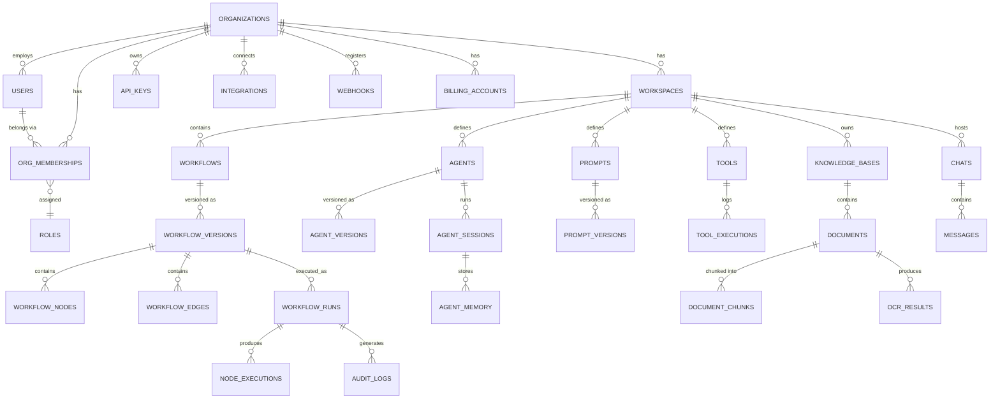
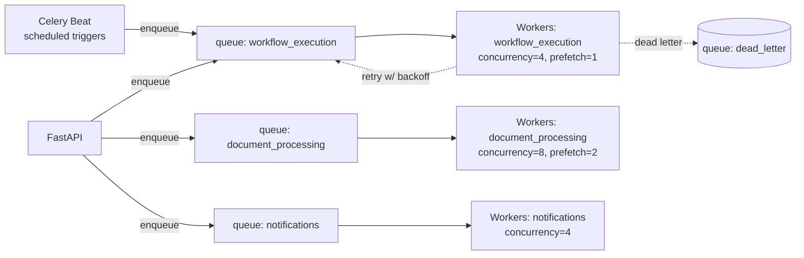
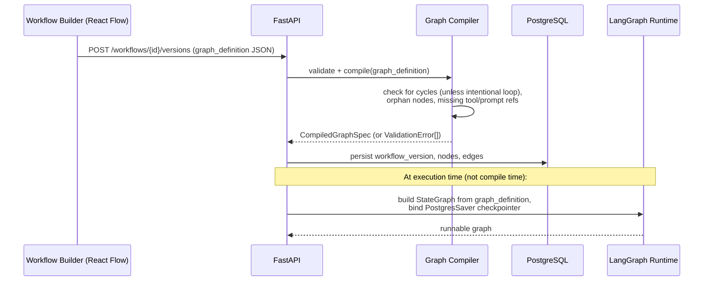
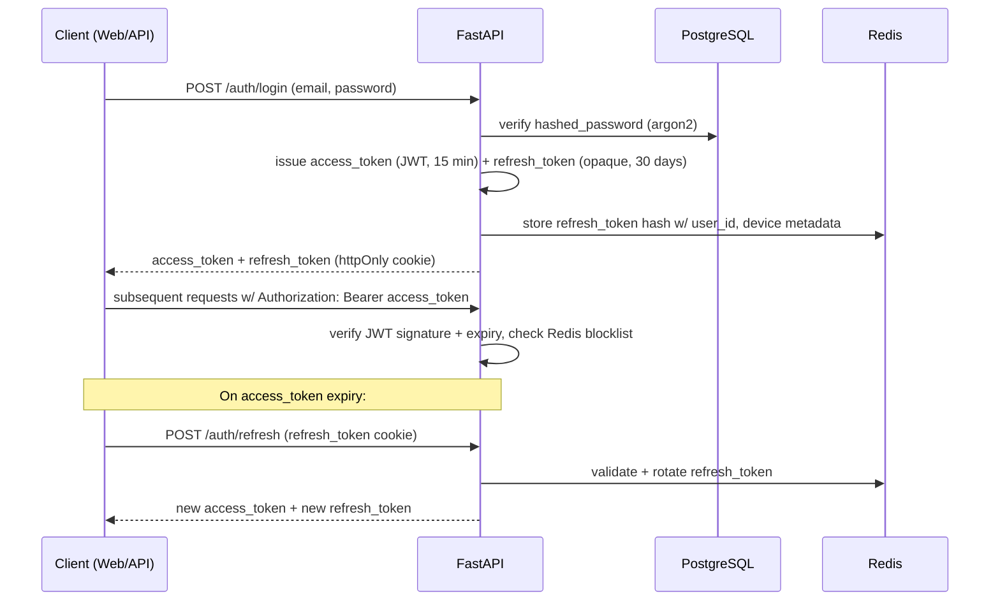

# Volume 2 — Backend Architecture
### AI Automation Platform — Engineering Blueprint, Volume 2 of 7

---

## Table of Contents

1. [FastAPI Application Structure](#1-fastapi-application-structure)
2. [Database Design](#2-database-design)
3. [Complete Database Schema](#3-complete-database-schema)
4. [Caching Strategy (Redis)](#4-caching-strategy-redis)
5. [Background Jobs (Celery)](#5-background-jobs-celery)
6. [LangGraph Architecture](#6-langgraph-architecture)
7. [Agent, Tool & Prompt Architecture](#7-agent-tool--prompt-architecture)
8. [OpenAI Integration & LangSmith](#8-openai-integration--langsmith)
9. [API Design](#9-api-design)
10. [Authentication & Authorization (RBAC)](#10-authentication--authorization-rbac)
11. [Rate Limiting](#11-rate-limiting)
12. [Logging & Observability](#12-logging--observability)
13. [Security](#13-security)
14. [Error Handling](#14-error-handling)
15. [Scaling Strategy](#15-scaling-strategy)
16. [Deployment & Docker](#16-deployment--docker)
17. [Cost Optimization](#17-cost-optimization)

---

## 1. FastAPI Application Structure

### 1.1 Module (modular monolith) layout

Every domain module under `apps/api/src/modules/<name>/` follows an identical internal shape, so any engineer can navigate an unfamiliar module in seconds:

```
modules/workflows/
├── router.py         # HTTP routes only — no business logic
├── schemas.py        # Pydantic request/response models
├── service.py         # Business logic, orchestrates repository + other services
├── repository.py     # SQLAlchemy queries, always organization-scoped
├── models.py          # SQLAlchemy ORM models owned by this module
├── exceptions.py      # Domain-specific exceptions
├── events.py           # Domain events published to other modules (e.g. WorkflowPublished)
└── tests/
```

**Layering rule:** `router → service → repository → models`. A router never touches a repository or ORM model directly; a repository never contains business rules. This keeps unit tests for `service.py` free of HTTP or SQL concerns (both are mocked).

### 1.2 Dependency injection

FastAPI's `Depends()` system is used for:
- Database session injection (`get_db_session`) — one session per request, closed on teardown.
- Current-user/organization resolution (`get_current_user`, `get_current_org`) — decoded once from the JWT, cached on `request.state`.
- Service instantiation (`get_workflow_service(db=Depends(get_db_session))`) — services are constructed per-request with their dependencies, never as global singletons, to avoid cross-request state leakage.

### 1.3 Cross-module communication

Modules communicate through **service interfaces**, never by importing another module's repository or ORM models directly. For decoupled side effects (e.g., "when a workflow run completes, send a notification and write an audit log"), the platform uses a lightweight **in-process event bus** (an `asyncio`-based pub/sub, backed by Redis Pub/Sub for the notification module's WebSocket fan-out):

```python
# modules/executions/service.py
async def complete_run(self, run: WorkflowRun) -> None:
    await self.repository.mark_completed(run)
    await self.event_bus.publish(WorkflowRunCompleted(
        run_id=run.id, organization_id=run.organization_id, status=run.status
    ))
```

```python
# modules/notifications/handlers.py
@event_bus.subscribe(WorkflowRunCompleted)
async def notify_on_completion(event: WorkflowRunCompleted) -> None:
    await notification_service.send(...)
```

This keeps `executions` decoupled from `notifications` and `audit_logs` — new subscribers can be added without modifying the publisher.

---

## 2. Database Design

### 2.1 Design goals

1. **Strict multi-tenant isolation** — every tenant-owned row carries `organization_id`; a repository base class injects this filter automatically.
2. **Full auditability** — workflow runs, node executions, and approvals are append-mostly and never hard-deleted.
3. **Versioning as a first-class concept** — workflows, prompts, and agents all have a `*_versions` table so a "live" definition can be edited without breaking in-flight runs (which pin to the version they started with).
4. **Vector + relational co-location** — pgvector columns live directly on the `document_chunks` table, avoiding a second database round-trip for hybrid search.

### 2.2 Entity-Relationship Diagram (core domain)



---

## 3. Complete Database Schema

> Types shown are PostgreSQL types. All tables include `id UUID PRIMARY KEY DEFAULT gen_random_uuid()`, `created_at TIMESTAMPTZ NOT NULL DEFAULT now()`, and `updated_at TIMESTAMPTZ NOT NULL DEFAULT now()` unless noted; these are omitted from the field lists below for brevity.

### 3.1 Identity & Tenancy

**`organizations`**
| Field | Type | Notes |
|---|---|---|
| name | text | Display name |
| slug | text unique | URL-safe identifier |
| plan | text | `free`, `pro`, `enterprise` — drives billing limits |
| settings | jsonb | Org-level feature flags, branding |
| is_active | boolean | Soft-disable without deleting |

**`users`**
| Field | Type | Notes |
|---|---|---|
| email | citext unique | Case-insensitive unique |
| hashed_password | text nullable | Null if SSO-only |
| full_name | text | |
| avatar_url | text nullable | |
| is_superadmin | boolean | Platform-level admin (not org admin) |
| mfa_enabled | boolean | |

**`org_memberships`** *(the join table that also carries role)*
| Field | Type | Notes |
|---|---|---|
| organization_id | uuid FK | |
| user_id | uuid FK | |
| role_id | uuid FK → roles | |
| status | text | `invited`, `active`, `suspended` |
| UNIQUE(organization_id, user_id) | | |

**`roles`**
| Field | Type | Notes |
|---|---|---|
| organization_id | uuid FK nullable | Null = system-defined role (Owner/Admin/Member/Viewer) |
| name | text | |
| permissions | jsonb | Array of permission strings, e.g. `["workflow:write","billing:read"]` |
| is_system | boolean | |

**`workspaces`**
| Field | Type | Notes |
|---|---|---|
| organization_id | uuid FK | |
| name | text | e.g. "Finance", "HR" |
| icon | text | |
| is_default | boolean | |

**`api_keys`**
| Field | Type | Notes |
|---|---|---|
| organization_id | uuid FK | |
| name | text | |
| key_prefix | text | First 8 chars shown in UI |
| hashed_key | text | SHA-256 hash; raw key shown once at creation |
| scopes | jsonb | Permission scopes |
| last_used_at | timestamptz nullable | |
| expires_at | timestamptz nullable | |
| revoked_at | timestamptz nullable | |

### 3.2 Workflow Engine

**`workflows`**
| Field | Type | Notes |
|---|---|---|
| workspace_id | uuid FK | |
| name | text | |
| description | text | |
| status | text | `draft`, `published`, `archived` |
| current_version_id | uuid FK nullable → workflow_versions | Points to the "live" version |
| trigger_type | text | `manual`, `schedule`, `webhook`, `email`, `event` |
| trigger_config | jsonb | e.g. cron expression, webhook secret |

**`workflow_versions`**
| Field | Type | Notes |
|---|---|---|
| workflow_id | uuid FK | |
| version_number | integer | Monotonically increasing per workflow |
| graph_definition | jsonb | Serialized node/edge graph (source of truth compiled into LangGraph) |
| published_by | uuid FK → users | |
| published_at | timestamptz nullable | Null while still draft |
| UNIQUE(workflow_id, version_number) | | |

**`workflow_nodes`**
| Field | Type | Notes |
|---|---|---|
| workflow_version_id | uuid FK | |
| node_key | text | Stable ID referenced by edges and executions, e.g. `"extract_invoice"` |
| node_type | text | `agent`, `tool`, `condition`, `human_approval`, `subgraph`, `start`, `end` |
| config | jsonb | Node-specific config (prompt id, tool id, condition expression) |
| position_x, position_y | float | Canvas coordinates |

**`workflow_edges`**
| Field | Type | Notes |
|---|---|---|
| workflow_version_id | uuid FK | |
| source_node_key | text | |
| target_node_key | text | |
| condition | jsonb nullable | For conditional edges: `{"when": "confidence < 0.8"}` |

**`workflow_runs`**
| Field | Type | Notes |
|---|---|---|
| workflow_version_id | uuid FK | |
| organization_id | uuid FK | Denormalized for fast tenant-scoped queries |
| status | text | `pending`, `running`, `waiting_approval`, `completed`, `failed`, `cancelled` |
| trigger_payload | jsonb | Input that started the run |
| checkpoint_state | jsonb | Latest LangGraph checkpoint (full resumable state) |
| current_node_key | text nullable | |
| started_at, completed_at | timestamptz nullable | |
| total_cost_usd | numeric(10,4) | Sum of node executions' cost |
| error | jsonb nullable | |

**`node_executions`**
| Field | Type | Notes |
|---|---|---|
| workflow_run_id | uuid FK | |
| node_key | text | |
| status | text | `succeeded`, `failed`, `skipped` |
| input | jsonb | |
| output | jsonb | |
| tokens_prompt, tokens_completion | integer nullable | |
| cost_usd | numeric(10,4) nullable | |
| latency_ms | integer | |
| attempt | integer | Retry count |

### 3.3 Agents, Tools, Prompts

**`agents`**
| Field | Type | Notes |
|---|---|---|
| workspace_id | uuid FK | |
| name | text | |
| description | text | |
| current_version_id | uuid FK nullable | |

**`agent_versions`**
| Field | Type | Notes |
|---|---|---|
| agent_id | uuid FK | |
| version_number | integer | |
| system_prompt_id | uuid FK → prompts | |
| model | text | e.g. `gpt-4.1`, `gpt-4.1-mini` |
| temperature | float | |
| tool_ids | jsonb | Array of tool UUIDs available to this agent |
| max_iterations | integer | Guards against runaway tool-call loops |

**`agent_sessions`**
| Field | Type | Notes |
|---|---|---|
| agent_id | uuid FK | |
| workflow_run_id | uuid FK nullable | Null if run standalone (e.g. Agent Playground) |
| status | text | |

**`agent_memory`**
| Field | Type | Notes |
|---|---|---|
| agent_session_id | uuid FK | |
| memory_type | text | `short_term`, `summary`, `long_term_fact` |
| content | text | |
| embedding | vector(1536) nullable | For semantic memory retrieval |

**`prompts`** / **`prompt_versions`**
| Field | Type | Notes |
|---|---|---|
| workspace_id | uuid FK (on `prompts`) | |
| name | text | |
| template | text (on `prompt_versions`) | Jinja2-style template with `{{variables}}` |
| variables_schema | jsonb | JSON Schema for expected variables |
| version_number | integer | |

**`tools`**
| Field | Type | Notes |
|---|---|---|
| workspace_id | uuid FK | |
| name | text | |
| tool_type | text | `http_request`, `python_function`, `erp_connector`, `mcp` |
| input_schema | jsonb | JSON Schema, exposed to the LLM as a function-calling spec |
| config | jsonb | Endpoint URL, auth reference, etc. |

**`tool_executions`**
| Field | Type | Notes |
|---|---|---|
| tool_id | uuid FK | |
| node_execution_id | uuid FK nullable | |
| input | jsonb | |
| output | jsonb | |
| status | text | |
| latency_ms | integer | |

### 3.4 Knowledge Base & RAG

**`knowledge_bases`**
| Field | Type | Notes |
|---|---|---|
| workspace_id | uuid FK | |
| name | text | |
| embedding_model | text | e.g. `text-embedding-3-large` |

**`documents`**
| Field | Type | Notes |
|---|---|---|
| knowledge_base_id | uuid FK | |
| file_name | text | |
| storage_path | text | MinIO object key |
| mime_type | text | |
| status | text | `uploaded`, `processing`, `indexed`, `failed` |
| page_count | integer nullable | |

**`ocr_results`**
| Field | Type | Notes |
|---|---|---|
| document_id | uuid FK | |
| page_number | integer | |
| raw_text | text | |
| structured_data | jsonb nullable | e.g. extracted invoice fields |
| confidence | float | |

**`document_chunks`**
| Field | Type | Notes |
|---|---|---|
| document_id | uuid FK | |
| chunk_index | integer | |
| content | text | |
| embedding | vector(1536) | pgvector column, HNSW-indexed |
| token_count | integer | |

### 3.5 Chat, Notifications, Audit

**`chats`** / **`messages`**
| Field | Type | Notes |
|---|---|---|
| workspace_id | uuid FK (on `chats`) | |
| chat_id | uuid FK (on `messages`) | |
| role | text | `user`, `assistant`, `system`, `tool` |
| content | text | |
| tool_calls | jsonb nullable | |

**`notifications`**
| Field | Type | Notes |
|---|---|---|
| organization_id | uuid FK | |
| user_id | uuid FK nullable | Null = org-wide |
| channel | text | `in_app`, `email`, `whatsapp`, `slack` |
| payload | jsonb | |
| read_at | timestamptz nullable | |

**`audit_logs`** *(append-only, never updated/deleted)*
| Field | Type | Notes |
|---|---|---|
| organization_id | uuid FK | |
| actor_type | text | `user`, `agent`, `system` |
| actor_id | uuid nullable | |
| action | text | e.g. `workflow.published`, `run.approved` |
| resource_type, resource_id | text, uuid | |
| metadata | jsonb | |
| ip_address | inet nullable | |

### 3.6 Billing, Integrations, Settings

**`billing_accounts`** / **`billing_usage_records`** / **`api_key`** (see §3.1) / **`integrations`** / **`webhooks`** / **`settings`** — full field-level definitions for these tables follow the identical pattern above (organization-scoped, versioned where mutable, append-only where transactional) and are enumerated in the companion schema migration files under `apps/api/src/db/migrations/`.

### 3.7 Indexing strategy

| Table | Index | Purpose |
|---|---|---|
| `workflow_runs` | `(organization_id, status, created_at DESC)` | Dashboard "recent runs" query |
| `node_executions` | `(workflow_run_id, node_key)` | Execution timeline reconstruction |
| `document_chunks` | HNSW on `embedding` (`vector_cosine_ops`) | Sub-100ms ANN search at 10M+ chunk scale |
| `document_chunks` | GIN on `to_tsvector('english', content)` | Hybrid search's keyword leg (Vol. 4 §7) |
| `audit_logs` | `(organization_id, created_at DESC)` + partitioning by month | Fast recent-audit queries; old partitions moved to cold storage |
| `api_keys` | unique on `hashed_key` | O(1) key lookup on every authenticated request |

### 3.8 Row-Level Security (defense in depth)

In addition to application-layer `organization_id` scoping (enforced by the repository base class), Postgres RLS policies are enabled on all tenant tables as a second line of defense:

```sql
ALTER TABLE workflow_runs ENABLE ROW LEVEL SECURITY;

CREATE POLICY tenant_isolation ON workflow_runs
    USING (organization_id = current_setting('app.current_org_id')::uuid);
```

The API sets `app.current_org_id` via `SET LOCAL` at the start of every request transaction, so even a missed `WHERE organization_id = ...` clause in application code cannot leak cross-tenant rows.

---

## 4. Caching Strategy (Redis)

| Use case | Pattern | TTL |
|---|---|---|
| JWT blocklist (revoked tokens) | Set membership check on every request | Token expiry |
| Org/user permission cache | Hash, invalidated on role change | 5 min |
| Workflow definition cache | Cache compiled LangGraph graph object per `workflow_version_id` | Until version changes (explicit invalidation) |
| Rate limiting | Sliding-window counter (see §11) | Window size |
| WebSocket fan-out | Redis Pub/Sub channel per `organization_id` for live run-status updates | N/A |
| Celery broker & result backend | Task queue + result store | Task-dependent |
| LLM response cache (optional, exact-match) | Hash of `(model, prompt, params)` → response, for idempotent re-runs in dev/test | 24h |

---

## 5. Background Jobs (Celery)

### 5.1 Queue topology



**Why separate queues per workload type:** a slow OCR job on `document_processing` must never starve time-sensitive `notifications`, and a spike in workflow triggers must not delay in-flight approval-notification delivery. Each queue has its own worker pool and concurrency tuned to its I/O profile (`workflow_execution` is LLM-latency-bound, low concurrency per worker to control cost bursts; `document_processing` is CPU/OCR-bound, higher concurrency).

### 5.2 Task design principles

- **Idempotency:** every task accepts an idempotency key (typically the `workflow_run_id` + `node_key`) and checks `node_executions` before re-executing a node that already succeeded — critical because Celery's at-least-once delivery can redeliver a task.
- **Bounded retries with exponential backoff:** `max_retries=3`, `retry_backoff=True`, `retry_backoff_max=600` — after exhaustion, the task moves to a dead-letter queue and raises an alert (Sentry + Slack webhook).
- **Long-running graph execution is chunked:** rather than one Celery task running an entire multi-hour workflow, each **LangGraph node boundary** is a natural checkpoint; the task re-enqueues itself after each node (or batch of nodes) so no single worker holds a task slot for hours, and a worker restart/deploy loses at most one node's progress.

---

## 6. LangGraph Architecture

> Full conceptual coverage (nodes, edges, conditional routing, streaming, interrupts, checkpointing theory) is in **Volume 4**. This section covers how LangGraph is *integrated into the backend system*.

### 6.1 Compilation pipeline



The **graph compiler** (`apps/api/src/graphs/compiler.py`) translates the visual, JSON graph definition stored in `workflow_versions.graph_definition` into a LangGraph `StateGraph` at *execution time*, not at save time — this means graph construction always reflects the current LangGraph library version and lets us evolve the runtime without a data migration.

### 6.2 State schema

Every workflow's state is a typed `TypedDict`/Pydantic model generated per-workflow from its node configs, always including a common envelope:

```python
class WorkflowState(TypedDict):
    run_id: str
    organization_id: str
    trigger_payload: dict
    node_outputs: dict[str, Any]     # keyed by node_key
    messages: list[BaseMessage]       # for agentic nodes needing chat history
    errors: list[dict]
    current_cost_usd: float
```

### 6.3 Checkpointing

The platform uses a **custom `PostgresSaver`** (LangGraph's checkpointer interface implemented against the existing `workflow_runs.checkpoint_state` column) rather than a separate checkpoint store, so a run's resumable state lives next to its metadata in one table and one transaction — avoiding a two-phase-commit problem between "mark run as waiting_approval" and "save checkpoint."

### 6.4 Human-in-the-loop interrupts

`human_approval` nodes call LangGraph's `interrupt()` primitive, which pauses graph execution and surfaces a typed payload to the frontend (e.g., "Approve this $4,200 invoice to Acme Corp?"). Resuming happens via `POST /executions/{run_id}/resume` with a typed decision payload, which LangGraph feeds back into the graph as the interrupt's return value — the graph continues exactly where it paused, with full prior state intact. See Volume 4 §2.5 for the full mechanics and Volume 5 for ERP approval examples.

### 6.5 Worker/runtime binding

Celery tasks in `apps/api/src/workers/graph_tasks.py` are thin: they resolve the workflow version, compile the graph, invoke it with the current checkpoint (or fresh trigger payload), and persist the result — all actual agent/tool logic lives inside the graph's nodes, not the Celery task, keeping the task layer a pure "invoke and persist" adapter.

---

## 7. Agent, Tool & Prompt Architecture

### 7.1 Agent execution model

An **agent node** in a workflow graph wraps a LangGraph "ReAct-style" subgraph: it calls the configured model with the current state + bound tools, and loops (tool call → tool result → model call) until the model returns a final answer or `max_iterations` is hit (a hard safety bound, since an unbounded agent loop is both a cost risk and a reliability risk).

### 7.2 Tool architecture

Tools are polymorphic by `tool_type`:

| Tool type | Execution | Example |
|---|---|---|
| `http_request` | Generic authenticated HTTP call via a config-driven adapter | "Look up vendor in NetSuite" |
| `python_function` | Sandboxed, pre-registered Python callables (never arbitrary user code in production) | "Compute tax withholding" |
| `erp_connector` | Purpose-built connector implementing a shared `ERPConnector` interface (`get_vendor`, `create_journal_entry`, ...) | QuickBooks/NetSuite/Odoo adapters (Vol. 5) |
| `mcp` | Model Context Protocol client — forward-compatible slot for external MCP servers (Slack, Asana, etc.) | Future integrations without custom adapter code |

Every tool's `input_schema` (JSON Schema) is what gets sent to OpenAI as a function-calling/tool spec — meaning the tool registry **is** the function-calling contract, with no separate "adapter schema" to keep in sync.

### 7.3 Prompt architecture

Prompts are versioned, parameterized Jinja2 templates decoupled from agents, so the same prompt can be reused by multiple agents and A/B tested independently of agent config changes. A `prompt_versions.variables_schema` (JSON Schema) is validated against the runtime variables before rendering, catching a missing-variable bug at render time rather than producing a malformed prompt silently.

---

## 8. OpenAI Integration & LangSmith

### 8.1 Model client abstraction

All OpenAI calls go through a single internal `LLMClient` wrapper (not scattered `openai.ChatCompletion.create()` calls) so that: retries/backoff, cost calculation, token counting, and LangSmith tracing are applied uniformly, and a future multi-provider need (Anthropic, open-weight models) requires changing one file.

### 8.2 Structured outputs

Extraction/classification nodes use OpenAI's structured output / JSON mode with a Pydantic-model-derived JSON Schema, so the model's response is parsed directly into a typed object — eliminating brittle regex/manual JSON parsing of free-text responses (full rationale in Volume 4 §6).

### 8.3 LangSmith integration

Every graph invocation is traced to LangSmith (project-per-environment: `aap-production`, `aap-staging`), giving:
- Full trace of every node, tool call, and model call with inputs/outputs.
- Prompt/response pairs for offline evaluation dataset curation.
- Regression testing: a curated "golden set" of ERP documents is re-run against new prompt/agent versions before promotion (Volume 4 §12).

---

## 9. API Design

### 9.1 Conventions

- **REST** over JSON for all CRUD and workflow-management endpoints; **WebSocket** for live execution status; no GraphQL (a deliberate simplicity choice — the frontend's data-fetching patterns are page-oriented, not graph-oriented, so REST + React Query's cache is sufficient without GraphQL's added complexity).
- URL structure: `/api/v1/{resource}` with tenant scope resolved from the auth token, never from the URL path (prevents an org-ID-in-URL tampering class of bugs).
- Pagination: cursor-based (`?cursor=...&limit=50`) on all list endpoints, not offset-based, since workflow runs and audit logs are high-volume, append-heavy tables where offset pagination degrades badly.

### 9.2 Example endpoints

| Method | Path | Purpose |
|---|---|---|
| `POST` | `/api/v1/workflows` | Create a workflow shell |
| `POST` | `/api/v1/workflows/{id}/versions` | Save a new graph version (draft) |
| `POST` | `/api/v1/workflows/{id}/publish` | Promote a version to "live" |
| `POST` | `/api/v1/workflows/{id}/run` | Trigger a manual run |
| `GET` | `/api/v1/executions/{run_id}` | Get run status + node execution history |
| `POST` | `/api/v1/executions/{run_id}/resume` | Resume a run paused on `human_approval` |
| `WS` | `/api/v1/ws/executions/{run_id}` | Live status stream |
| `POST` | `/api/v1/knowledge-bases/{id}/documents` | Upload + index a document |
| `POST` | `/api/v1/chat/{chat_id}/messages` | Send a chat message (streamed response) |

### 9.3 Sample payloads

**Trigger a run:**
```json
POST /api/v1/workflows/8f2b.../run
{
  "trigger_payload": {
    "email": {
      "from": "billing@acme-vendor.com",
      "subject": "Invoice #INV-2291",
      "attachments": ["s3://uploads/inv-2291.pdf"]
    }
  }
}
```

**Response:**
```json
{
  "run_id": "b7e1c2a4-...",
  "status": "running",
  "current_node_key": "extract_invoice",
  "started_at": "2026-07-23T09:12:04Z"
}
```

**Resume after human approval:**
```json
POST /api/v1/executions/b7e1c2a4-.../resume
{
  "decision": "approved",
  "approved_by": "user_9f21...",
  "comment": "Confirmed vendor and amount match PO-4471."
}
```

### 9.4 Versioning

The API is versioned at the URL path (`/api/v1/...`). Breaking changes ship as `/api/v2/...` with the previous version maintained for a documented deprecation window (see Volume 7 §7 for the release/versioning policy).

---

## 10. Authentication & Authorization (RBAC)

### 10.1 Authentication flow



- **Access tokens** are short-lived (15 min) signed JWTs containing `user_id`, `org_id`, and a permission-cache version stamp.
- **Refresh tokens** are opaque, stored hashed in Redis with device fingerprint metadata, rotated on every use (refresh-token rotation defeats replay if one is stolen).
- **OAuth2** (Google, Microsoft) is supported for SSO login and, separately, for **integration** authorization (e.g., Gmail read access for the email trigger) — these are two distinct OAuth flows with different scopes, never conflated.

### 10.2 RBAC model

| Role (system default) | Typical permissions |
|---|---|
| **Owner** | All permissions, including billing and org deletion |
| **Admin** | All except billing/org deletion |
| **Editor** | Create/edit workflows, agents, prompts; cannot manage members or billing |
| **Approver** | Can approve/reject `human_approval` nodes; read-only elsewhere |
| **Viewer** | Read-only across all resources |

Custom roles (enterprise plan) compose from the same permission-string vocabulary (`workflow:read`, `workflow:write`, `billing:read`, `member:invite`, ...), stored as a JSON array on `roles.permissions` and checked via a single `require_permission("workflow:write")` FastAPI dependency.

---

## 11. Rate Limiting

| Scope | Limit (default plan) | Mechanism |
|---|---|---|
| Per API key | 600 requests/min | Redis sliding-window counter, `429` with `Retry-After` header |
| Per organization, workflow triggers | Plan-dependent (e.g. 1,000 runs/day on Pro) | Redis counter, resets daily; enforced before Celery enqueue |
| Per organization, OpenAI token spend | Configurable monthly budget cap | Checked against `billing_usage_records` running total before each LLM call; blocks new agentic calls (not already-running deterministic nodes) once exceeded, with an alert at 80% |
| Login attempts | 5/min per IP + 10/hour per account | Redis counter, exponential lockout backoff |

---

## 12. Logging & Observability

### 12.1 Stack roles

| Tool | Role |
|---|---|
| **OpenTelemetry** | Distributed tracing across FastAPI → Celery → LangGraph node → OpenAI call, with a single `trace_id` correlating a workflow run end-to-end. |
| **Prometheus** | Metrics: request latency histograms, queue depth, worker concurrency, token-spend counters, node-failure rates. |
| **Grafana** | Dashboards: system health, per-organization cost, workflow SLA adherence. |
| **Sentry** | Exception capture with full stack trace + request/task context; alerting on new error signatures. |
| **LangSmith** | AI-specific tracing: prompt/response pairs, tool-call sequences, agent reasoning traces (complements, doesn't replace, OTel). |

### 12.2 Structured logging

All logs are JSON, emitted with a consistent envelope (`timestamp`, `level`, `trace_id`, `organization_id`, `module`, `message`, `extra`), shipped to stdout (captured by the container runtime) — no direct file logging, keeping containers stateless and 12-factor compliant.

---

## 13. Security

- **Encryption at rest:** Postgres volume encryption (VPS disk-level or managed-DB-provider encryption) + MinIO server-side encryption for stored documents/attachments.
- **Encryption in transit:** TLS 1.2+ everywhere (Nginx terminates TLS; internal Docker-network traffic is on a private bridge network).
- **Secrets management:** environment variables injected via Docker secrets / GitHub Actions encrypted secrets; never committed; integration credentials (ERP API keys, OAuth tokens) are encrypted at the application layer (AES-256-GCM) before being stored in `integrations.credentials`.
- **Least privilege:** each Celery worker pool and the API run as distinct, unprivileged container users; database roles are scoped (a read-only role for the analytics/BI connection, a write role for the API).
- **Input validation:** every request body validated by Pydantic before touching a service; file uploads are type/size/magic-byte validated before being written to MinIO or passed to OCR.
- **Prompt-injection mitigation:** content extracted from untrusted sources (inbound emails, uploaded documents) is passed to LLMs inside clearly delimited data blocks with an explicit system-prompt instruction that data-block content is *never* instructions — plus tool calls that can mutate ERP state require a policy check (Volume 4 §11) independent of what the model "decided."
- **Dependency scanning:** `pip-audit`/`npm audit` run in CI on every PR; Dependabot enabled.
- **Audit log immutability:** `audit_logs` rows are insert-only at the application layer (no `UPDATE`/`DELETE` route exists), and a Postgres trigger rejects `UPDATE`/`DELETE` at the database layer as well.

---

## 14. Error Handling

| Failure class | Strategy |
|---|---|
| Transient LLM API errors (rate limit, timeout) | Automatic retry with exponential backoff (via `LLMClient`), up to 3 attempts, then node marked `failed` and surfaced to the run's error list. |
| ERP connector failures (auth expired, endpoint down) | Retry with backoff; if exhausted, run transitions to `waiting_approval`-equivalent `needs_attention` state with a notification to the workflow owner, rather than silently failing the whole run. |
| Validation errors (bad graph definition, malformed trigger payload) | Rejected synchronously at the API layer with a structured `422` response — never enqueued to a worker. |
| Unexpected exceptions | Caught by a global FastAPI exception handler, logged to Sentry with full context, returns a generic `500` to the client (no internal detail leakage), while Celery tasks report the same via a task `on_failure` hook. |
| Partial workflow failure | Node-level failure does not necessarily fail the whole run — conditional edges can route to a "handle_error" node (e.g., "notify AP clerk for manual review") instead of hard-failing, matching real-world exception handling (Volume 5). |

---

## 15. Scaling Strategy

| Dimension | Approach |
|---|---|
| **API layer** | Stateless FastAPI containers behind Nginx; horizontal scale by adding containers (no sticky sessions needed since auth is JWT-based). |
| **Worker layer** | Celery worker pools scale independently per queue (Volume 2 §5); CPU-bound OCR workers and LLM-latency-bound execution workers scale on different triggers (queue depth vs. CPU). |
| **Database** | Vertical scaling first (mid-market load profile fits comfortably on a well-sized single primary); read replicas for analytics/reporting queries once write load justifies it; partitioning `audit_logs` and `node_executions` by month at scale. |
| **Vector search** | pgvector HNSW index tuned (`m`, `ef_construction`) for the current corpus size; a migration path to a dedicated vector DB is documented but deferred until benchmarks show pgvector as the bottleneck (Volume 4 §7). |
| **Object storage** | MinIO scales via distributed mode (erasure-coded) or a cutover to AWS S3 — no application code change required, since access is via the S3 API. |
| **Multi-region** | Deferred until an enterprise contract requires data residency; the modular monolith and stateless API design keep this a deployment change, not an architecture change. |

---

## 16. Deployment & Docker

*(Full topology, CI/CD pipeline, and production hardening are covered in Volume 6. This section summarizes the backend-specific container contract.)*

```dockerfile
# apps/api/Dockerfile (excerpt)
FROM python:3.12-slim AS base
WORKDIR /app
COPY pyproject.toml poetry.lock ./
RUN pip install poetry && poetry install --no-root --only main
COPY src/ ./src/
COPY alembic/ ./alembic/
ENV PYTHONUNBUFFERED=1
CMD ["uvicorn", "src.main:app", "--host", "0.0.0.0", "--port", "8000"]
```

Migrations run as a pre-deploy step (`alembic upgrade head`) in the GitHub Actions deploy job, never on container boot, so multiple API replicas never race to apply the same migration.

---

## 17. Cost Optimization

| Lever | Technique |
|---|---|
| **Model routing** | Cheap/fast models (`gpt-4.1-mini`) for classification and low-ambiguity extraction; escalate to a stronger model only when confidence is below threshold (Volume 4 §14). |
| **Prompt caching** | OpenAI prompt caching leveraged for large, stable system prompts (e.g., a long ERP policy document included in every invoice-validation call). |
| **Embedding reuse** | Documents are embedded once and cached; re-indexing only occurs on content change (hash comparison). |
| **Batching** | Non-real-time nodes (e.g., nightly reconciliation) use the OpenAI Batch API at reduced cost where latency tolerance allows. |
| **Token budgeting** | Per-organization monthly spend caps (§11) prevent runaway cost from a misconfigured loop or unexpectedly large document volume. |
| **Infra right-sizing** | Worker autoscaling on queue depth avoids paying for idle capacity outside business hours. |

Full USD/PKR cost modeling at 100/1,000/10,000/100,000-user scale is in **Volume 7 §9 (Cost Analysis)**.

poetry run uvicorn src.main:app --reload --host 127.0.0.1 --port 8000
docker run -d --name redisinsight -p 5540:5540 redis/redisinsight:latest

---

*Continue to **Volume 3 — Frontend Architecture** for the Next.js application structure, workflow builder implementation, and full page-by-page UI specification.*
