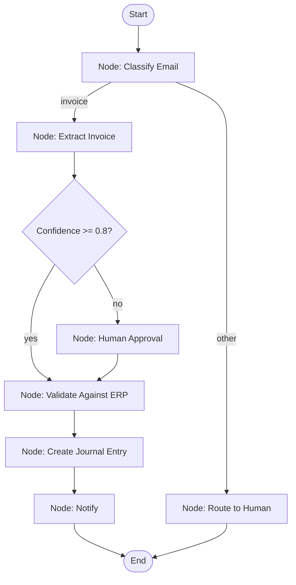
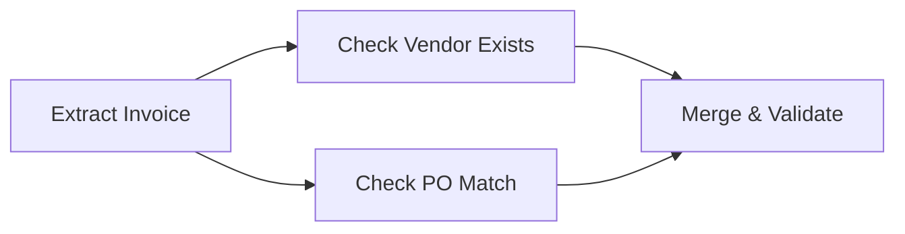
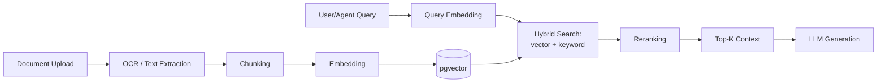

# Volume 4 — AI Engineering
### AI Automation Platform — Engineering Blueprint, Volume 4 of 7

---

## Table of Contents

1. [LangGraph From First Principles](#1-langgraph-from-first-principles)
2. [Core LangGraph Concepts](#2-core-langgraph-concepts)
3. [Agent Collaboration Patterns](#3-agent-collaboration-patterns)
4. [Tool Calling](#4-tool-calling)
5. [Prompt Engineering](#5-prompt-engineering)
6. [Structured Outputs, JSON Mode & Function Calling](#6-structured-outputs-json-mode--function-calling)
7. [Retrieval-Augmented Generation (RAG)](#7-retrieval-augmented-generation-rag)
8. [OCR Pipeline](#8-ocr-pipeline)
9. [Embedding Pipeline](#9-embedding-pipeline)
10. [Hybrid Search & Reranking](#10-hybrid-search--reranking)
11. [Context Engineering & Model Selection](#11-context-engineering--model-selection)
12. [AI Evaluation & LangSmith](#12-ai-evaluation--langsmith)
13. [Hallucination Reduction](#13-hallucination-reduction)
14. [Token & Cost Optimization](#14-token--cost-optimization)
15. [Knowledge Graph & Future MCP Compatibility](#15-knowledge-graph--future-mcp-compatibility)

---

## 1. LangGraph From First Principles

### 1.1 Why not a simple chain?

A "chain" (prompt → LLM → parse → next prompt → LLM) is a straight line: it cannot pause for a human, cannot retry a failed step in isolation, cannot branch conditionally in a structured way, and loses all progress on a crash. **LangGraph** models a workflow instead as a **graph of nodes and edges over an explicit, typed state object**, where the framework itself owns execution, checkpointing, and resumption — the same reason real distributed systems use durable workflow engines (Temporal, AWS Step Functions) rather than a script with retries bolted on.

### 1.2 The mental model

Think of a LangGraph workflow as a flowchart you could draw on a whiteboard:



Every box is a **node** (a Python function or a bound sub-graph); every arrow is an **edge** (unconditional or conditional); the whole thing operates over one shared **state** object that flows through the graph and accumulates results.

---

## 2. Core LangGraph Concepts

### 2.1 Nodes

A node is any callable `(state: WorkflowState) -> dict` that returns a **partial state update** (LangGraph merges it into the running state via reducer functions, not a full state replacement) — this is what lets multiple nodes safely contribute to, say, an append-only `messages` list without clobbering each other.

```python
def extract_invoice_node(state: WorkflowState) -> dict:
    result = llm_client.extract(state["trigger_payload"]["attachment"])
    return {
        "node_outputs": {**state["node_outputs"], "extract_invoice": result},
        "current_cost_usd": state["current_cost_usd"] + result.cost_usd,
    }
```

### 2.2 Edges

- **Normal edges** — `graph.add_edge("extract_invoice", "confidence_check")` — always taken.
- **Conditional edges** — `graph.add_conditional_edges("confidence_check", route_fn, {"high": "validate", "low": "human_approval"})` — `route_fn(state)` returns a key that selects the next node, implementing branching logic as plain Python rather than a fragile prompt-based "decide what to do next" call.

### 2.3 Conditional edges in practice

```python
def route_by_confidence(state: WorkflowState) -> str:
    confidence = state["node_outputs"]["extract_invoice"]["confidence"]
    return "high" if confidence >= 0.8 else "low"
```

This is the platform's core design principle from Volume 1 §13 made concrete: **the branching decision is deterministic code**, even though the *input* to that decision (the confidence score) came from a model.

### 2.4 Parallel execution

LangGraph supports **fan-out/fan-in**: a node can have multiple outgoing edges to nodes with no data dependency on each other (e.g., simultaneously calling "check vendor exists" and "check PO exists"), which the runtime executes concurrently, then a downstream node declared to depend on both waits for both branches before running — implemented via LangGraph's superstep model (all nodes ready to run in a given "tick" execute together, akin to Pregel-style bulk synchronous processing).



### 2.5 Human approval / interrupts

```python
def human_approval_node(state: WorkflowState) -> dict:
    decision = interrupt({
        "type": "approval_request",
        "summary": f"Approve ${state['node_outputs']['extract_invoice']['amount']}?",
    })
    return {"node_outputs": {**state["node_outputs"], "human_approval": decision}}
```

Calling `interrupt(payload)` **pauses graph execution entirely** — the current state is checkpointed (§2.7), the payload is surfaced to the frontend (Volume 3 §6.1), and the Celery worker slot is freed (the run is *not* holding a thread/worker while waiting on a human, which could be hours or days). When `POST /executions/{run_id}/resume` is called with a decision, LangGraph re-invokes the graph from the checkpoint, and `interrupt()` *returns* the resume payload as if it were a normal function call — the node's code below the `interrupt()` call continues exactly as written.

### 2.6 Retries

Node-level retry policy is declared per node (`RetryPolicy(max_attempts=3, backoff_factor=2)`), distinct from Celery's task-level retry (Volume 2 §5.2) — a node retry re-runs just that node's logic against the same input state, while a Celery-task retry re-invokes the worker adapter that resumes the graph; the two layers compose (Celery handles infrastructure-level failures like a worker crash, LangGraph node retries handle logic-level transient failures like an API 500).

### 2.7 Persistence & checkpointing

After every superstep, LangGraph serializes the full state to the configured **checkpointer** (Volume 2 §6.3's custom `PostgresSaver`). This gives:

- **Resumability** — a crashed worker or restarted deployment can pick a run back up from its last checkpoint, never re-running already-succeeded nodes.
- **Time travel** — any past checkpoint can be inspected or even forked into a new run (useful for "replay this failed run with a fixed prompt" debugging).
- **Auditability** — the exact state at every node boundary is queryable, satisfying the Volume 1 §13 requirement that every run be fully replayable.

### 2.8 Memory

Two distinct memory concepts are used:
- **Checkpoint state** (above) — the mechanical, resumable state of one graph run.
- **Agent memory** (`agent_memory` table, Volume 2 §3.3) — semantic, cross-session memory an agent can *choose* to write/recall (e.g., "this vendor's invoices are always net-30, don't flag it") — a product feature, not an execution-mechanics feature.

### 2.9 Streaming

LangGraph's `.stream()` API emits an event per superstep (or per token, for LLM calls using streaming completions), which the Celery worker forwards onto the Redis Pub/Sub channel (Volume 2 §4) that the frontend's WebSocket connection subscribes to — this is what powers the live-updating execution timeline (Volume 3 §6.1) and the node status rings on the builder canvas (Volume 3 §4.3).

### 2.10 StateGraph vs. compiled graph

`StateGraph` is the *builder* API (`add_node`, `add_edge`, `add_conditional_edges`); calling `.compile(checkpointer=...)` produces an immutable, runnable graph object. The platform's graph compiler (Volume 2 §6.1) always constructs a fresh `StateGraph` from the stored JSON definition and compiles it at execution time, so the compiled graph is never itself persisted (avoiding version-skew between a stored compiled object and the installed LangGraph library version).

---

## 3. Agent Collaboration Patterns

| Pattern | When used | Implementation |
|---|---|---|
| **Single agent + tools (ReAct loop)** | Default pattern for most agent nodes | One agent node subgraph, tool-call loop bounded by `max_iterations` |
| **Supervisor/router** | A node needs to delegate to one of several specialist agents (e.g., "Finance Q&A" vs. "HR Q&A" chat routing) | A lightweight classification node routes to the appropriate agent subgraph via conditional edges — not a "meta-agent" with all tools, which dilutes tool-selection accuracy |
| **Sequential specialist pipeline** | ERP workflows with clearly staged responsibilities (extract → validate → book) | Each stage is its own agent/tool node, deliberately *not* one agent with all responsibilities — smaller, single-purpose prompts are more reliable and cheaper (Volume 5) |
| **Subgraphs as reusable units** | A validation sequence used by multiple workflows (e.g., "vendor + PO + budget check" reused across Invoice Processing and Purchase Approval) | Modeled as a LangGraph subgraph, invoked as a single node from the parent graph, matching the `subgraph` node type in the builder (Volume 3 §4.1) |

The platform deliberately avoids unbounded multi-agent "society of agents" patterns (agents freely conversing with no supervisory structure) for production ERP workflows — they are harder to audit, harder to bound in cost, and unnecessary for the well-scoped business processes this platform targets. Free-form multi-agent conversation is available in the **Agent Playground** (Volume 3 §8) for experimentation but is not how production workflow graphs are structured.

---

## 4. Tool Calling

### 4.1 Mechanics

The platform uses OpenAI's native function-calling: each `tools` row (Volume 2 §3.3) contributes one function spec (name, description, JSON-Schema parameters) to the API call. The model's response either contains a final message or one or more `tool_calls`; the agent-node loop executes each requested tool (via the polymorphic tool executor, Volume 2 §7.2), appends the tool result as a `tool` role message, and calls the model again — standard ReAct mechanics, implemented as a small bounded loop inside the agent node rather than a hand-rolled parser of free-text "Action: ..." style outputs (which structured tool calling has made obsolete).

### 4.2 Tool description quality

Tool descriptions are treated as a first-class prompt-engineering artifact, not incidental metadata — a vague description ("gets vendor info") measurably increases wrong-tool-selection rates versus a precise one ("Look up a vendor by exact legal name or tax ID in the connected ERP; returns null if not found — do not use for fuzzy/partial name matching, use `search_vendors` instead"). The platform's tool registry UI (Volume 3) surfaces a "test this tool's selection accuracy" evaluation against a small held-out prompt set before a tool is marked production-ready.

### 4.3 Guardrails on tool calls

Tools that mutate external state (`erp_connector` writes, sending a WhatsApp notification) are marked `is_mutating: true` in their config; mutating tool calls emitted by an agent are logged to `tool_executions` *before* execution (not after), so a crash mid-call still leaves an audit trail of intent — and, for the highest-risk mutations (e.g., "post journal entry," "issue payment"), the workflow graph is required to route through a `human_approval` node upstream, enforced by a compiler lint rule (Volume 2 §6.1) that flags a published workflow if a mutating financial tool has no upstream approval node in its dependency path.

---

## 5. Prompt Engineering

### 5.1 Prompt structure convention

Every system prompt in the platform follows a consistent internal structure to keep prompts auditable and diffable across versions:

```
[ROLE] — who the agent is and its scope of authority
[CONTEXT] — relevant static knowledge (policies, ERP schema hints)
[TASK] — the specific instruction for this node
[OUTPUT FORMAT] — the exact structure expected (paired with a JSON Schema, §6)
[CONSTRAINTS] — explicit "never do X" boundaries (e.g., "never invent a vendor ID")
[DATA] — the untrusted input, always inside clearly delimited tags (see Volume 2 §13 prompt-injection note)
```

### 5.2 Few-shot examples

Extraction and classification prompts include 2–4 curated few-shot examples drawn from the organization's own historical corrected data (once available) rather than generic examples — an org's own invoice formats/vendors are far more representative than synthetic examples, and the prompt template system (Volume 2 §7.3) supports per-organization example injection via `variables_schema`.

### 5.3 Prompt versioning & rollback

Every edit to a prompt creates a new `prompt_versions` row (Volume 2 §3.3); an agent version pins to a specific prompt version, so editing a prompt template never silently changes the behavior of an already-published, in-flight workflow — a new agent version must be published and the workflow explicitly upgraded, matching the platform-wide versioning principle (Volume 1 §13).

---

## 6. Structured Outputs, JSON Mode & Function Calling

Extraction/classification nodes never rely on asking the model to "output JSON" in free text and then regex-parsing it — a fragile pattern that breaks on markdown code fences, trailing commentary, or minor formatting drift. Instead, the platform uses OpenAI's structured outputs feature: a Pydantic model defines the exact expected shape, its `.model_json_schema()` is passed as the `response_format`, and the SDK guarantees schema-conformant JSON back, deserialized directly into the same Pydantic model:

```python
class InvoiceExtraction(BaseModel):
    vendor_name: str
    invoice_number: str
    amount: float
    currency: str
    line_items: list[LineItem]
    confidence: float = Field(ge=0, le=1)

response = llm_client.parse(
    messages=[...],
    response_format=InvoiceExtraction,
)
extracted: InvoiceExtraction = response.parsed
```

This eliminates an entire class of parsing bugs and makes the `confidence` field (used by the conditional-edge routing in §2.3) a guaranteed, typed float rather than a hopefully-present string.

---

## 7. Retrieval-Augmented Generation (RAG)

### 7.1 Pipeline overview



### 7.2 Chunking strategy

Documents are chunked with a **semantic-aware recursive splitter** (paragraph → sentence fallback), target ~400–600 tokens per chunk with a 15% overlap, rather than a fixed-character split — preserving whole clauses/sentences measurably improves retrieval precision for financial and policy documents where a split mid-clause changes meaning (e.g., a payment-terms clause cut in half).

### 7.3 Why pgvector over a dedicated vector DB (recap + detail)

Beyond the operational-simplicity argument in Volume 1 §9.1, pgvector's advantage here is that hybrid search (§10) becomes a **single SQL query** joining vector similarity and full-text rank in one round-trip, rather than a client-side merge of two separate systems' result sets — simpler code, one transaction, one consistency model.

---

## 8. OCR Pipeline

1. **Pre-processing:** deskew, denoise, and DPI-normalize scanned images before OCR (a fixed pipeline step, not model-dependent).
2. **Text extraction:** a layout-aware OCR engine extracts text with bounding boxes, preserving table structure (critical for invoice line-items) rather than a flat text dump.
3. **Structured extraction:** the OCR'd text (plus, where useful, the original image for vision-capable models) is passed to the extraction agent node (§6), producing the typed `InvoiceExtraction`-style object.
4. **Confidence scoring:** OCR-level confidence (character/field confidence from the OCR engine) is combined with the LLM's own self-reported `confidence` field into a single routing signal for the `confidence_check` conditional edge (§2.3) — a low-confidence OCR read on the amount field should route to human approval even if the LLM is "confident" given a possibly-garbled input.
5. **Storage:** raw OCR output persists to `ocr_results` (Volume 2 §3.4) independent of the final structured extraction, so a later re-extraction (e.g., after a prompt improvement) doesn't require re-running OCR.

---

## 9. Embedding Pipeline

- **Model:** `text-embedding-3-large` (configurable per knowledge base) for a strong balance of retrieval quality vs. cost/dimensionality (1536-dim, matching the `document_chunks.embedding` column, Volume 2 §3.4).
- **Idempotency:** each chunk's content hash is stored alongside its embedding; re-processing a document only re-embeds chunks whose content actually changed, avoiding redundant embedding cost on minor document edits.
- **Batch embedding:** documents are embedded via the batch endpoint where latency isn't user-facing (bulk knowledge-base imports), falling back to synchronous embedding for single-document uploads where the user is waiting on an "indexed" status.

---

## 10. Hybrid Search & Reranking

### 10.1 Hybrid query

```sql
WITH vector_results AS (
    SELECT id, content, 1 - (embedding <=> :query_embedding) AS vector_score
    FROM document_chunks
    WHERE knowledge_base_id = :kb_id
    ORDER BY embedding <=> :query_embedding
    LIMIT 50
),
keyword_results AS (
    SELECT id, content, ts_rank(to_tsvector('english', content), plainto_tsquery(:query_text)) AS keyword_score
    FROM document_chunks
    WHERE knowledge_base_id = :kb_id
      AND to_tsvector('english', content) @@ plainto_tsquery(:query_text)
    LIMIT 50
)
SELECT COALESCE(v.id, k.id) AS id,
       COALESCE(v.content, k.content) AS content,
       (COALESCE(v.vector_score, 0) * 0.7 + COALESCE(k.keyword_score, 0) * 0.3) AS combined_score
FROM vector_results v
FULL OUTER JOIN keyword_results k ON v.id = k.id
ORDER BY combined_score DESC
LIMIT 20;
```

The 0.7/0.3 weighting is configurable per knowledge base; keyword search meaningfully helps on exact-match needs vector search alone under-serves (invoice numbers, exact account codes, vendor tax IDs).

### 10.2 Reranking

The top ~20 hybrid candidates are passed through a cross-encoder reranker before final top-K (typically 5) selection — a cross-encoder scores query+chunk pairs jointly (more accurate than the bi-encoder similarity used for initial retrieval) but is too slow to run over the full corpus, hence the two-stage retrieve-then-rerank design.

---

## 11. Context Engineering & Model Selection

### 11.1 Model selection matrix

| Task | Default model | Escalation model | Rationale |
|---|---|---|---|
| Email/document classification | `gpt-4.1-mini` | `gpt-4.1` (if confidence < 0.7) | High volume, low ambiguity — cost matters most |
| Invoice/structured extraction | `gpt-4.1-mini` (text-only) / `gpt-4.1` (vision, poor-quality scans) | `gpt-4.1` | Vision capability needed for low-quality scans |
| Free-form chat / Q&A (RAG) | `gpt-4.1` | — | User-facing quality bar is higher |
| Complex multi-step agent reasoning (e.g., reconciliation) | `gpt-4.1` | — | Longer reasoning chains benefit from the stronger model |

### 11.2 Context engineering principles

- **Minimum sufficient context:** a node's prompt includes only the state fields it actually needs (via explicit selection, not "dump the whole state object"), keeping prompts small, cheap, and less prone to distraction from irrelevant fields.
- **Structured over prose context:** where possible, context is passed as compact structured data (a JSON object of relevant fields) rather than a paragraph description of the same data — models parse structured context more reliably and it costs fewer tokens.
- **Static content ordered for prompt caching:** stable content (system role, org policy text, tool definitions) is placed before the variable, per-request content, aligning with OpenAI prompt-caching's prefix-matching behavior (Volume 2 §17).

---

## 12. AI Evaluation & LangSmith

### 12.1 Golden datasets

Each production agent has a curated "golden set" — real (anonymized) historical inputs paired with a human-verified correct output — stored as a LangSmith dataset. A new prompt or agent version must meet a minimum accuracy threshold against the golden set (e.g., ≥95% field-level accuracy on invoice extraction) before it can be promoted to "live" via the platform's version-promotion workflow (mirroring the compiler-gate pattern from Volume 2 §6.1).

### 12.2 Evaluation dimensions

| Dimension | Method |
|---|---|
| Extraction accuracy | Field-level exact/fuzzy match against golden labels |
| Tool selection correctness | Did the agent call the expected tool(s) in the expected order? |
| Groundedness (RAG) | LLM-as-judge check that the answer is supported by retrieved chunks (no unsupported claims) |
| Latency | p50/p95 per node type, tracked over time to catch regressions |
| Cost | Token cost per run, tracked per workflow version to catch prompt-bloat regressions |

### 12.3 Continuous evaluation

LangSmith traces from production (sampled, and 100% for `failed` or low-confidence runs) feed back into golden-set curation — a recurring extraction mistake becomes a new golden-set example plus a prompt fix, closing the loop between production monitoring and prompt engineering.

---

## 13. Hallucination Reduction

1. **Ground every claim in retrieved or provided data** — agents are instructed (and, for RAG answers, evaluated per §12.2) to answer only from supplied context/tool results, with an explicit "say you don't know" instruction rather than an incentive to always produce an answer.
2. **Structured outputs constrain the output space** (§6) — a model cannot hallucinate an extra unexpected field or format deviation the downstream code isn't prepared for.
3. **Confidence scores are trained into the extraction contract** (§6's `confidence` field) so the *system* — not the model's tone — is what decides whether to trust an output, since models can be fluently wrong.
4. **Tool results are treated as ground truth over model claims** — if a tool call returns "vendor not found," the agent's prompt explicitly instructs it not to proceed as if the vendor exists regardless of what its training data "knows" about common vendor names.
5. **Human approval as a backstop, not a crutch** — the confidence-based routing (§2.3) ensures uncertain outputs reach a human, rather than relying solely on prompt-level hallucination mitigation for high-stakes financial decisions.

---

## 14. Token & Cost Optimization

Recap and expansion of Volume 2 §17's levers, from the AI-engineering side:

- **Prompt compaction:** system prompts are periodically audited for redundant instructions; a shorter, well-structured prompt often *outperforms* a longer one by reducing instruction-following dilution, in addition to costing less.
- **Escalation-only strong-model usage** (§11.1) keeps the expensive model reserved for the minority of genuinely ambiguous cases.
- **Response length constraints:** extraction/classification nodes request the minimum necessary output (no explanatory prose unless a field explicitly calls for it), since structured-output schemas already prevent the model from padding responses.
- **Batch API for non-real-time nodes:** nightly reconciliation and bulk-reprocessing jobs use OpenAI's Batch API at a meaningful cost discount, since these nodes tolerate multi-hour turnaround.

---

## 15. Knowledge Graph & Future MCP Compatibility

- **Knowledge graph (future direction):** entity-relationship extraction (vendors ↔ invoices ↔ POs ↔ approvers) into a graph layer is a documented future enhancement for cross-document reasoning ("show me all invoices from vendors related to this flagged entity") — deferred until the relational schema's join-based queries (Volume 2 §3) demonstrably can't serve this need at acceptable latency, per the platform's build-only-what's-justified principle.
- **MCP (Model Context Protocol):** the `tools.tool_type = 'mcp'` slot (Volume 2 §7.2) is a forward-compatible integration point — as third-party services expose MCP servers, the platform can consume them as tools without writing bespoke connector code, extending the tool registry without a schema change.

---

*Continue to **Volume 5 — ERP Automation** for fully worked, diagrammed examples of every core finance, HR, and sales workflow this platform is designed to run.*
