# Volume 5 — ERP Automation
### AI Automation Platform — Engineering Blueprint, Volume 5 of 7

> This volume is the platform's strongest differentiator: fully worked, diagrammed business workflows spanning Finance, Procurement, HR, and Sales — each modeled as a real LangGraph graph using the node taxonomy from Volume 3 §4.1 and the execution semantics from Volume 4.

---

## Table of Contents

1. [Finance: Invoice Processing](#1-finance-invoice-processing)
2. [Finance: Vendor Registration](#2-finance-vendor-registration)
3. [Finance: Purchase Approval](#3-finance-purchase-approval)
4. [Finance: Expense Approval](#4-finance-expense-approval)
5. [Finance: Journal Validation](#5-finance-journal-validation)
6. [Finance: Ledger Search Assistant](#6-finance-ledger-search-assistant)
7. [Finance: Trial Balance Assistant](#7-finance-trial-balance-assistant)
8. [Finance: Bank Reconciliation Assistant](#8-finance-bank-reconciliation-assistant)
9. [Finance: Payment Approval](#9-finance-payment-approval)
10. [Finance: Financial Reporting Assistant](#10-finance-financial-reporting-assistant)
11. [Finance: Tax Validation](#11-finance-tax-validation)
12. [Finance: Budget Approval](#12-finance-budget-approval)
13. [Procurement Automation](#13-procurement-automation)
14. [HR: Leave Approval](#14-hr-leave-approval)
15. [HR: Payroll Validation](#15-hr-payroll-validation)
16. [HR: Attendance Automation](#16-hr-attendance-automation)
17. [Sales: Quotation Assistant](#17-sales-quotation-assistant)
18. [Sales: CRM Automation](#18-sales-crm-automation)
19. [Inventory Automation](#19-inventory-automation)

---

## 1. Finance: Invoice Processing

**Business context:** An AP clerk currently opens each vendor email, reads the attached PDF, keys the invoice into the ERP, checks it against a purchase order, and routes it for manager approval if it exceeds a threshold.

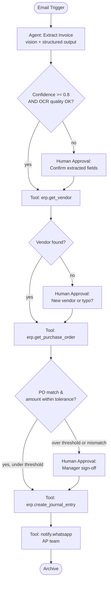

**Node detail:**

| Node | Type | Notes |
|---|---|---|
| Extract Invoice | Agent | Vision-capable model on the PDF; returns `InvoiceExtraction` (Volume 4 §6) |
| erp.get_vendor | Tool (`erp_connector`) | Exact match on tax ID/legal name |
| erp.get_purchase_order | Tool (`erp_connector`) | Matches invoice line items against open POs, 2-way or 3-way match |
| erp.create_journal_entry | Tool (`erp_connector`) | Only reachable after all upstream approval gates |

**Exception paths modeled explicitly:** low-confidence extraction, unknown vendor, PO mismatch, and over-threshold amount each have a *distinct* human-approval node with a tailored prompt to the reviewer — a single generic "please review" step would force every reviewer to re-derive *why* the case needs attention.

---

## 2. Finance: Vendor Registration

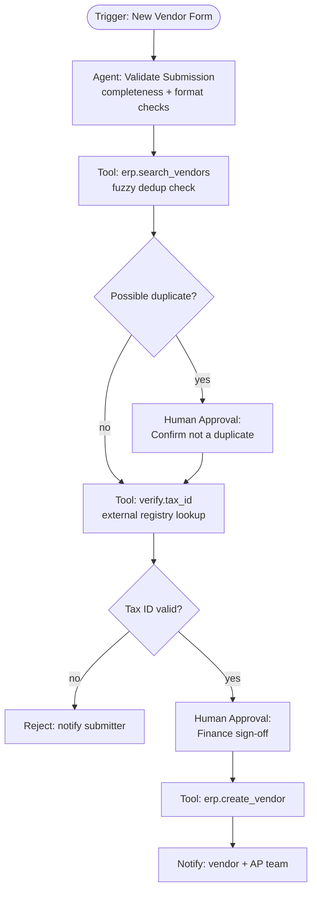

**Why duplicate-detection matters:** vendor master-data duplication is one of the most common sources of duplicate payments in mid-market finance; the fuzzy-dedup tool call (name similarity + tax-ID exact match + address similarity) runs *before* any human touches the request, surfacing likely-duplicate matches directly in the approval prompt.

---

## 3. Finance: Purchase Approval

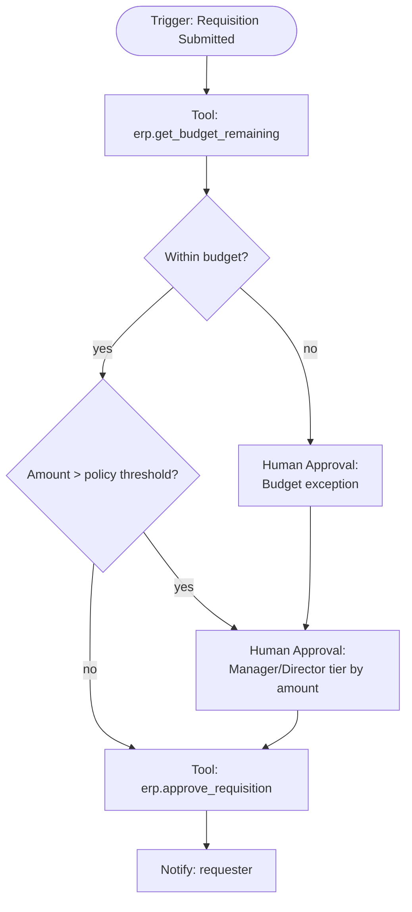

**Approval-tier routing:** the platform's condition nodes implement a **tiered approval matrix** (e.g., <$1,000 auto-approved if in budget; $1,000–$10,000 manager approval; >$10,000 director approval) as a lookup against an org-configured policy table rather than hardcoded thresholds, so finance teams can adjust policy without a workflow republish.

---

## 4. Finance: Expense Approval

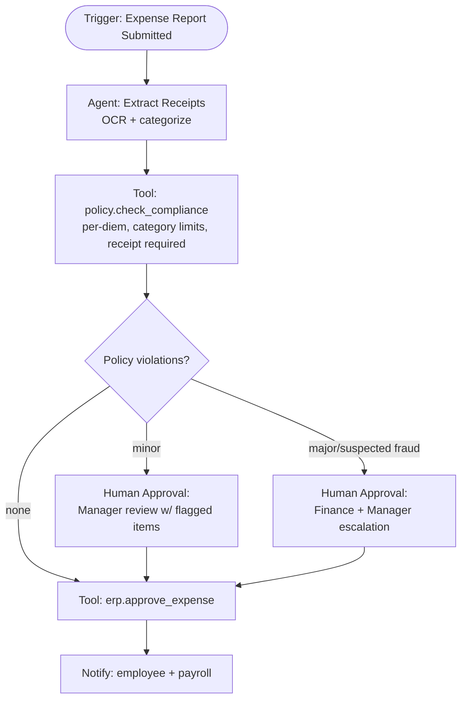

**Policy-as-data:** expense policy rules (per-diem caps, category-specific limits, mandatory-receipt thresholds) are stored as structured org settings, consumed by the `policy.check_compliance` tool as deterministic code — never left to an LLM's judgment of "is this reasonable," keeping policy enforcement consistent and auditable.

---

## 5. Finance: Journal Validation

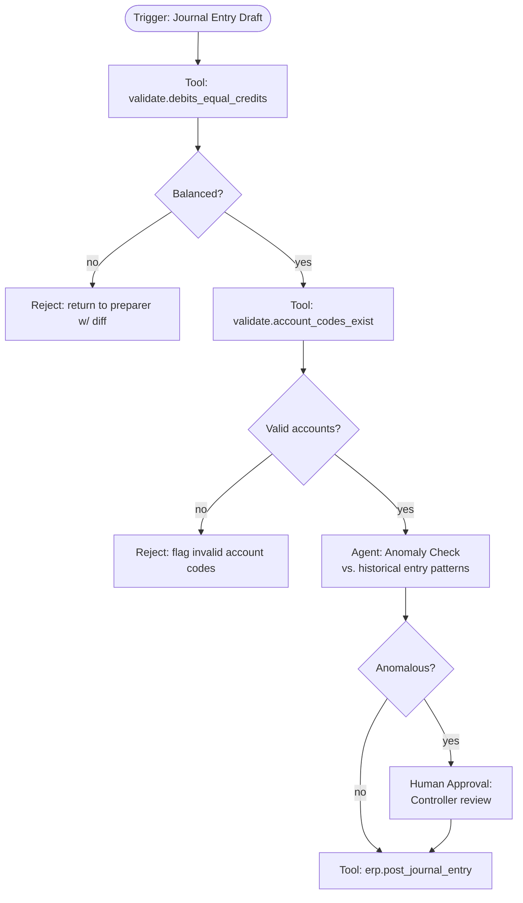

**Deterministic first, agentic second:** balance-check and account-code validation are pure arithmetic/lookup (never an LLM call — there is zero ambiguity in "do debits equal credits"); only the *anomaly detection* step (comparing this entry's pattern against the account's historical entry distribution) is agentic, since that judgment genuinely benefits from pattern reasoning over historical context.

---

## 6. Finance: Ledger Search Assistant

A **chat-based** (not workflow-graph) agent (Volume 3 §9) backed by RAG over the general ledger export and a `erp_query` tool for live lookups, letting a controller ask "show me all entries to the travel expense account over $500 in Q2" in natural language rather than building a filtered report in the ERP UI. Grounding: every answer cites the specific ledger entries retrieved (Volume 4 §13), never a paraphrased summary without traceable source rows.

---

## 7. Finance: Trial Balance Assistant

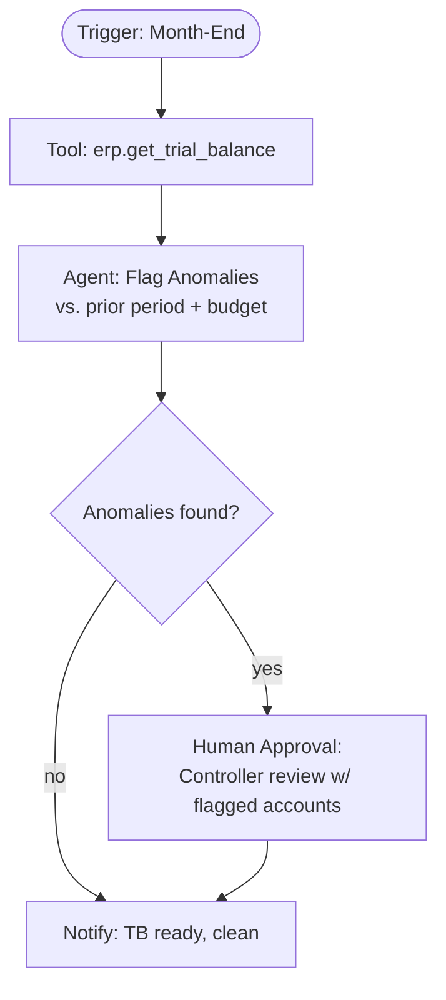

Flags: accounts with unusual period-over-period variance, accounts that should net to zero but don't, and suspense/clearing accounts with a non-zero balance past a configurable age — surfaced with the agent's reasoning attached so the controller doesn't have to re-derive *why* an account was flagged.

---

## 8. Finance: Bank Reconciliation Assistant

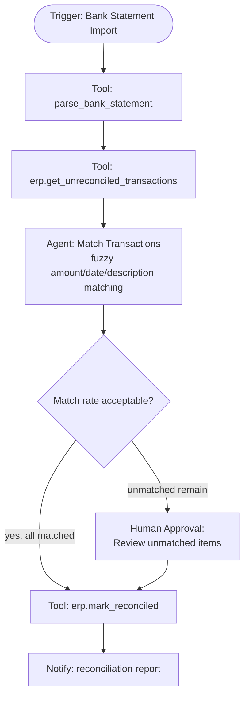

The matching agent scores candidate matches (amount ± tolerance, date proximity, description similarity) and only *proposes* matches above a confidence floor automatically — items below the floor are queued for human review rather than force-matched, since an incorrect auto-reconciliation is far more costly to unwind than a manual review step.

---

## 9. Finance: Payment Approval

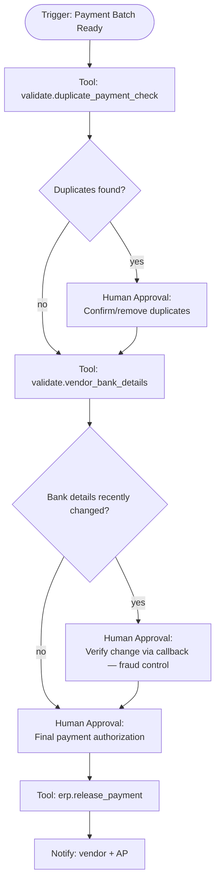

**Fraud control emphasis:** a recent change to a vendor's bank details is one of the most common vectors for payment-fraud (business email compromise); this workflow *always* forces a human verification step in that case regardless of amount, overriding the normal tiered-approval logic — a deliberate, hardcoded policy exception, not a configurable threshold.

---

## 10. Finance: Financial Reporting Assistant

A scheduled workflow that assembles a monthly management report: `erp.get_pnl`, `erp.get_balance_sheet`, and `erp.get_cash_flow` tool calls feed an agent that drafts a narrative variance commentary ("Revenue grew 8% MoM driven by..."), which is always routed through a `human_approval` node before distribution — financial narrative headed to executives/board is never auto-sent without a human sign-off, regardless of how confident the drafting agent is.

---

## 11. Finance: Tax Validation

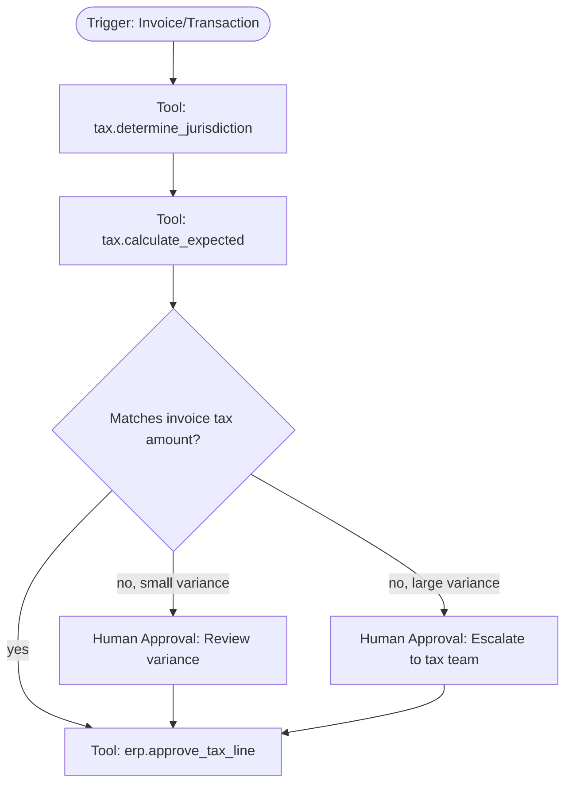

Tax rate/jurisdiction logic is sourced from a maintained tax-rules table (not model knowledge, which can be stale or jurisdiction-ambiguous) — the agent's role is limited to jurisdiction determination from address/entity data, with the actual rate calculation performed deterministically.

---

## 12. Finance: Budget Approval

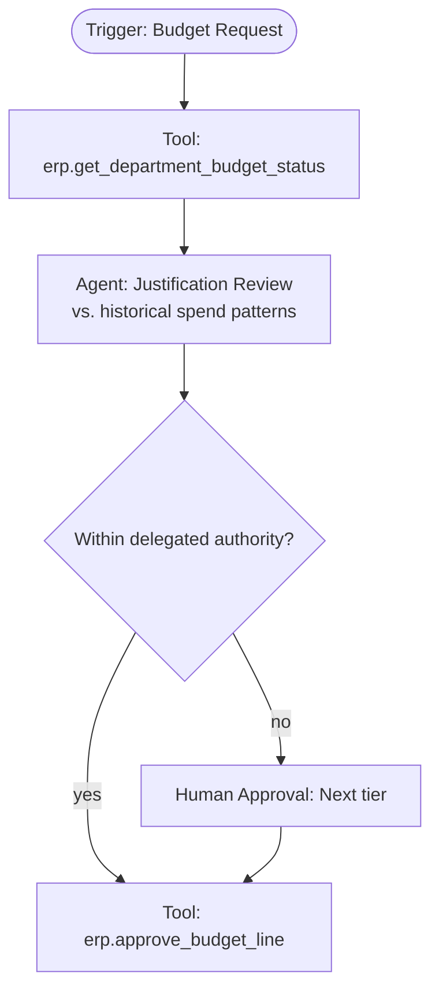

---

## 13. Procurement Automation

End-to-end chain linking **Purchase Approval (§3)** → PO issuance → **Vendor Registration (§2)** (if new vendor) → goods-receipt confirmation → **Invoice Processing (§1)** three-way match — implemented as a parent workflow that invokes the relevant workflows as **subgraphs** (Volume 4 §3), demonstrating the platform's reusable-subgraph pattern rather than duplicating logic across a monolithic "procurement" workflow.

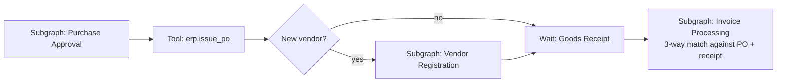

---

## 14. HR: Leave Approval

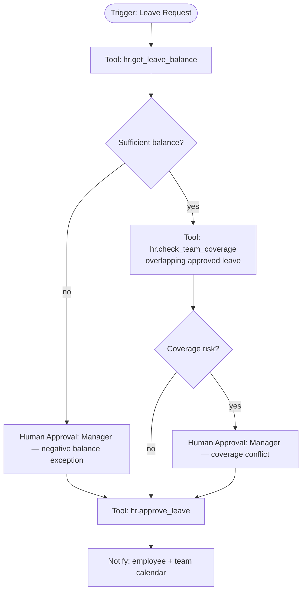

---

## 15. HR: Payroll Validation

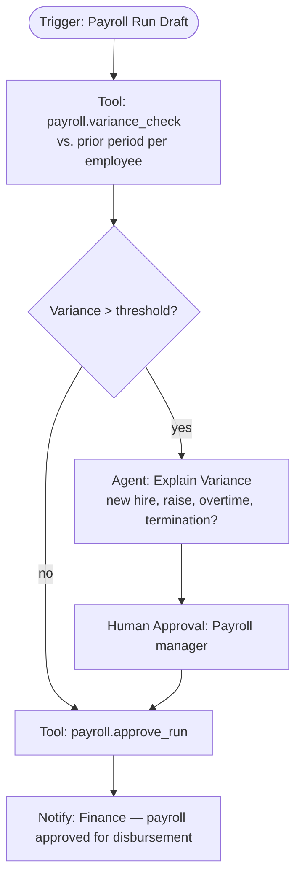

The variance-explanation agent's job is narrow and specific: attribute *why* an individual's pay changed using structured HR data (start date, comp changes, timesheet hours) — never a free-form guess, always grounded in queried records.

---

## 16. HR: Attendance Automation

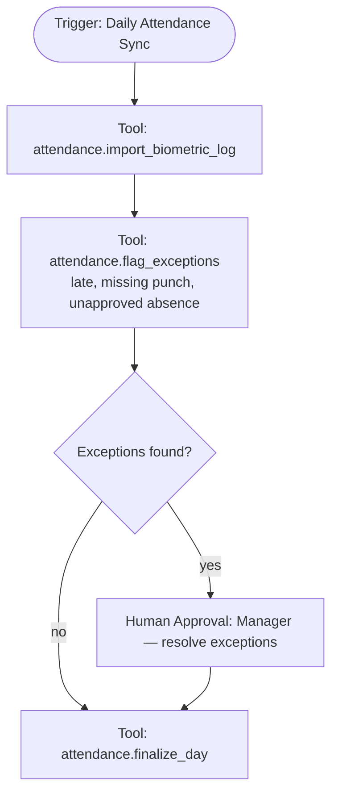

---

## 17. Sales: Quotation Assistant

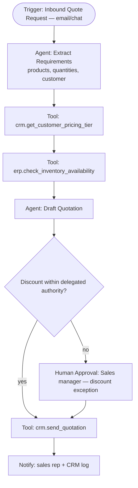

---

## 18. Sales: CRM Automation

Inbound emails/calls are classified (new lead, existing customer inquiry, support issue) and routed: new leads trigger `crm.create_lead` + enrichment tool calls (company size, industry) and a notification to the assigned rep; existing-customer inquiries are matched to the CRM record and logged as an activity — all deterministic CRM writes, with an agent used only for the classification and enrichment-summary steps, keeping the CRM as system-of-record integrity fully in deterministic tool code.

---

## 19. Inventory Automation

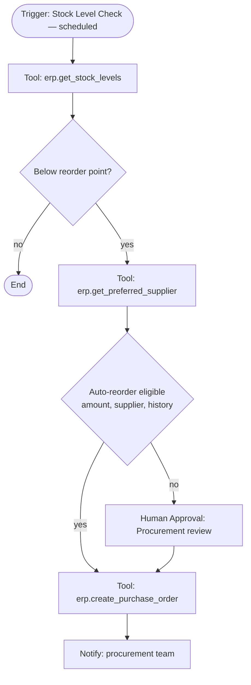

---

## Cross-Workflow Design Notes

- **Consistent pattern across all 19 workflows:** deterministic validation first, agentic judgment second, human approval as an explicit graph node (not an afterthought) whenever financial risk, fraud risk, or policy ambiguity is present.
- **Every workflow above is directly expressible in the visual builder** (Volume 3 §4) using only the seven node types defined in Volume 3 §4.1 — no workflow in this volume required extending the node taxonomy, validating that the taxonomy is sufficiently general for real ERP automation.
- **Reusability:** Vendor Registration, Invoice Processing, and Purchase Approval are each also invoked as subgraphs from Procurement Automation (§13), demonstrating the subgraph pattern's practical value beyond a single workflow.

---

*Continue to **Volume 6 — Deployment & Operations** for Docker topology, CI/CD, monitoring, and disaster-recovery planning.*
