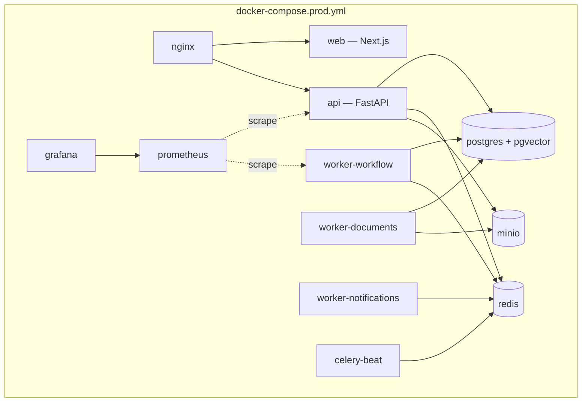
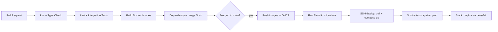

# Volume 6 — Deployment & Operations
### AI Automation Platform — Engineering Blueprint, Volume 6 of 7

---

## Table of Contents

1. [Docker & Docker Compose Topology](#1-docker--docker-compose-topology)
2. [Reverse Proxy, SSL & Domain](#2-reverse-proxy-ssl--domain)
3. [CI/CD (GitHub Actions)](#3-cicd-github-actions)
4. [Production Deployment on a Linux VPS](#4-production-deployment-on-a-linux-vps)
5. [Monitoring Stack](#5-monitoring-stack)
6. [Backups](#6-backups)
7. [Scaling: Horizontal & Vertical](#7-scaling-horizontal--vertical)
8. [Future Kubernetes Migration](#8-future-kubernetes-migration)
9. [Disaster Recovery & High Availability](#9-disaster-recovery--high-availability)

---

## 1. Docker & Docker Compose Topology

### 1.1 Service inventory



### 1.2 `docker-compose.prod.yml` (excerpt)

```yaml
services:
  api:
    image: ghcr.io/org/aap-api:${IMAGE_TAG}
    env_file: .env.production
    depends_on: [postgres, redis, minio]
    restart: unless-stopped
    networks: [internal]
    deploy:
      resources:
        limits: { cpus: "1.0", memory: 1g }

  worker-workflow:
    image: ghcr.io/org/aap-api:${IMAGE_TAG}
    command: celery -A src.workers.app worker -Q workflow_execution -c 4
    env_file: .env.production
    depends_on: [postgres, redis]
    restart: unless-stopped
    networks: [internal]

  worker-documents:
    image: ghcr.io/org/aap-api:${IMAGE_TAG}
    command: celery -A src.workers.app worker -Q document_processing -c 8
    env_file: .env.production
    networks: [internal]

  celery-beat:
    image: ghcr.io/org/aap-api:${IMAGE_TAG}
    command: celery -A src.workers.app beat
    networks: [internal]

  web:
    image: ghcr.io/org/aap-web:${IMAGE_TAG}
    env_file: .env.production
    networks: [internal]

  postgres:
    image: pgvector/pgvector:pg16
    volumes: [pg_data:/var/lib/postgresql/data]
    networks: [internal]

  redis:
    image: redis:7-alpine
    volumes: [redis_data:/data]
    networks: [internal]

  minio:
    image: minio/minio:latest
    command: server /data --console-address ":9001"
    volumes: [minio_data:/data]
    networks: [internal]

  nginx:
    image: nginx:alpine
    ports: ["443:443", "80:80"]
    volumes:
      - ./infra/nginx/conf.d:/etc/nginx/conf.d
      - ./infra/nginx/certs:/etc/nginx/certs
    depends_on: [api, web]
    networks: [internal, public]

networks:
  internal: { internal: true }
  public: {}

volumes:
  pg_data:
  redis_data:
  minio_data:
```

**Design notes:**
- `internal` network is not internet-routable; only `nginx` bridges to `public`, so Postgres/Redis/MinIO are never directly internet-exposed.
- Each worker pool is its own service/container group (Volume 2 §5.1), scaled independently via `docker compose up --scale worker-documents=4`.
- Resource `limits` prevent one runaway container (e.g., a worker processing an unusually large PDF) from starving the API container on the same host.

---

## 2. Reverse Proxy, SSL & Domain

- **Nginx** terminates TLS (certificates via **Let's Encrypt / certbot**, auto-renewed via a cron container), proxies `/api/*` to the `api` service, everything else to `web`, and upgrades WebSocket connections (`Upgrade`/`Connection` headers) for the `/api/v1/ws/*` execution-status stream.
- **Domain structure:** `app.aiautomation.example` (dashboard), `api.aiautomation.example` (API, also reachable via `app.../api` path-based routing to avoid a second CORS-exposed origin where possible), `aiautomation.example` (marketing site).
- **HSTS, security headers** (CSP, X-Frame-Options, X-Content-Type-Options) configured at the Nginx layer, applied uniformly regardless of individual route handler discipline.

---

## 3. CI/CD (GitHub Actions)

### 3.1 Pipeline



### 3.2 `ci.yml` (excerpt)

```yaml
name: CI
on: [pull_request]
jobs:
  backend:
    runs-on: ubuntu-latest
    steps:
      - uses: actions/checkout@v4
      - uses: actions/setup-python@v5
        with: { python-version: "3.12" }
      - run: pip install poetry && poetry install
      - run: poetry run ruff check .
      - run: poetry run mypy src/
      - run: poetry run pytest --cov=src --cov-fail-under=80
      - run: poetry run pip-audit

  frontend:
    runs-on: ubuntu-latest
    steps:
      - uses: actions/checkout@v4
      - uses: actions/setup-node@v4
        with: { node-version: "20" }
      - run: npm ci
      - run: npm run lint && npm run typecheck
      - run: npm run test
      - run: npm run build
```

### 3.3 Deploy job gating

Deployment to production requires: (1) all CI checks green, (2) merge to `main`, (3) a manual approval gate (GitHub Environments protection rule) for production specifically — staging deploys automatically on merge, production requires a human click, matching the platform's own "irreversible actions need a human" philosophy applied to its own delivery pipeline.

---

## 4. Production Deployment on a Linux VPS

**Initial sizing (0–1,000 users):** a single VPS (8 vCPU / 32GB RAM / NVMe SSD) running the full Compose stack comfortably serves the API, workers, Postgres, Redis, and MinIO for the early customer base — this is a deliberate "start simple" choice (Volume 1 §9) rather than premature Kubernetes adoption.

**Deploy mechanics:** GitHub Actions SSHes into the VPS, pulls the newly tagged images from GHCR, runs `alembic upgrade head` via a one-off container, then `docker compose up -d` performs a rolling replace of changed services (API/worker containers restart with the new image; Postgres/Redis/MinIO containers are untouched since their image tag doesn't change on an app deploy).

**Zero-downtime consideration:** the API is run with 2+ replicas behind Nginx even on a single VPS, so a rolling `docker compose up -d --no-deps api` replaces one replica at a time without a user-facing gap; the same pattern applies to `web`.

---

## 5. Monitoring Stack

| Signal | Tool | Alert condition (example) |
|---|---|---|
| Request latency (p95) | Prometheus + Grafana | p95 > 2s for 5 min sustained |
| Queue depth | Prometheus (Celery exporter) | `workflow_execution` queue depth > 100 for 10 min |
| Error rate | Sentry | New error signature, or error rate > 1% of requests |
| Database connections | Prometheus (postgres_exporter) | Connections > 80% of pool size |
| Disk usage | Node exporter | Disk > 85% full |
| Token spend rate | Custom Prometheus metric from `LLMClient` | Organization approaching monthly cap (80% threshold) |
| Workflow run failure rate | Custom metric per workflow | Failure rate > 10% over 1 hour for any single workflow |

Grafana dashboards are organized per audience: an **Engineering dashboard** (infra health, latency, error rates) and a **Business dashboard** (runs/day, cost/day, approval SLA) — the same Prometheus data source, different views for different stakeholders.

---

## 6. Backups

| Data | Method | Frequency | Retention |
|---|---|---|---|
| PostgreSQL | `pg_dump` (logical) to MinIO/S3 + WAL archiving for point-in-time recovery | Nightly full + continuous WAL | 30 days rolling, monthly snapshot kept 1 year |
| MinIO objects (documents, attachments) | Bucket replication to a secondary region/provider | Continuous (async replication) | Matches document retention policy per organization |
| Redis | Not backed up (treated as ephemeral cache/broker) — Celery task state that must survive a Redis loss lives in Postgres (`workflow_runs.checkpoint_state`), not Redis | N/A | N/A |
| Configuration/secrets | Encrypted backup of `.env.production` and Nginx certs to a separate secrets vault | On change | Version-controlled history |

**Restore drills:** a quarterly restore drill (restore the latest backup into a scratch environment, run smoke tests) is scheduled to validate that backups are actually restorable, not just "backups exist" — a documented practice, not just a policy statement.

---

## 7. Scaling: Horizontal & Vertical

Recap of Volume 2 §15 from the infrastructure/ops lens:

- **Vertical first:** the single-VPS model scales vertically (bigger instance) up to a documented ceiling (~5,000–10,000 users depending on workflow volume) before horizontal complexity is justified.
- **Horizontal next:** API/worker containers move to multiple VPS instances behind a load balancer (still Compose-based, via Docker Swarm mode or a simple multi-host Nginx upstream) once vertical headroom is exhausted — Postgres remains a single primary with read replicas for reporting queries at this stage.
- **Database scaling:** managed Postgres (e.g., moving off self-hosted to a managed provider) is the first infrastructure migration considered at scale, since operational burden (backups, failover, patching) grows faster than raw compute needs.

---

## 8. Future Kubernetes Migration

Documented as a **deferred, not default**, path: the Compose service definitions map close to 1:1 onto Kubernetes Deployments/Services (each Compose service becomes a Deployment; `internal`/`public` networks become NetworkPolicies), meaning the migration is primarily a manifest-translation exercise rather than an architecture rewrite — validating the "modular monolith + Compose" choice in Volume 1 §9 as one that doesn't paint the platform into a corner.

**Trigger conditions for the Kubernetes migration** (documented, not yet met):
- Multi-region deployment requirement from an enterprise contract.
- Worker autoscaling needs that exceed what a fixed Compose replica count can serve cost-effectively.
- A second engineering team needing independent deploy cadences for a service extracted from the modular monolith.

---

## 9. Disaster Recovery & High Availability

| Scenario | Recovery approach | Target |
|---|---|---|
| VPS instance failure | Restore from latest backup onto a new instance; DNS cutover | RTO: ~2 hours; RPO: <15 min (WAL-based) |
| Database corruption | Point-in-time recovery from WAL archive | RPO: <15 min |
| Region/provider outage | Secondary-region MinIO replica + documented cross-provider Postgres restore runbook | RTO: ~4 hours (manual failover, no auto-failover at current scale) |
| Accidental data deletion (application bug) | Audit-log-driven reconstruction where possible; point-in-time restore to a scratch DB for surgical row recovery | Case-by-case, audit log (Volume 2 §3.5) is the primary forensic source |
| Celery/Redis loss mid-run | Workflow runs resume from their last Postgres-persisted checkpoint (Volume 4 §2.7) — no data loss beyond the in-flight (uncheckpointed) node | RPO: 1 node's worth of work |

High availability beyond this (multi-AZ Postgres failover, active-active API across regions) is explicitly out of scope until customer contracts or scale genuinely require it — matching the platform-wide principle of building only what current, real need justifies (Volume 1 §13).

---

*Continue to **Volume 7 — Development Roadmap & Go-to-Market** for the sprint plan, testing strategy, cost analysis, and portfolio/positioning guidance.*
