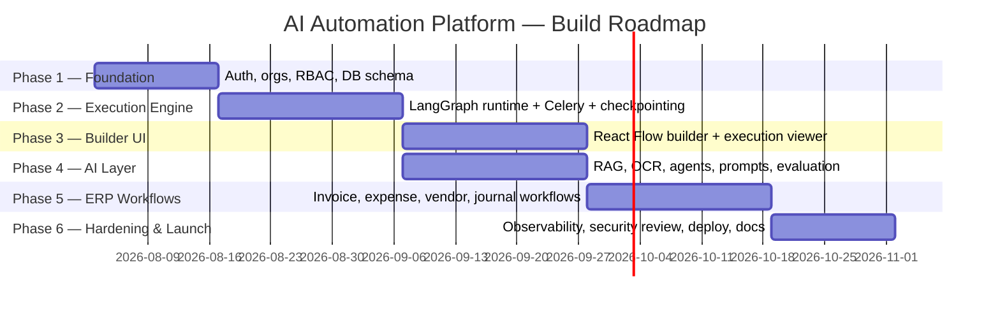

# Volume 7 — Development Roadmap & Go-to-Market
### AI Automation Platform — Engineering Blueprint, Volume 7 of 7

---

## Table of Contents

1. [Development Roadmap Overview](#1-development-roadmap-overview)
2. [Weekly Roadmap](#2-weekly-roadmap)
3. [Sprint Planning & GitHub Issues](#3-sprint-planning--github-issues)
4. [Testing Strategy](#4-testing-strategy)
5. [Documentation Strategy](#5-documentation-strategy)
6. [GitHub Quality Standards](#6-github-quality-standards)
7. [Versioning & Release Strategy](#7-versioning--release-strategy)
8. [Demo Preparation](#8-demo-preparation)
9. [Cost Analysis (USD & PKR)](#9-cost-analysis-usd--pkr)
10. [Portfolio & Positioning Strategy](#10-portfolio--positioning-strategy)
11. [Upwork & Client Pitching](#11-upwork--client-pitching)

---

## 1. Development Roadmap Overview

The build is sequenced in **six phases** over roughly 16 weeks for a small team (1–3 engineers), front-loading the parts of the system that de-risk the hardest technical bets (LangGraph execution engine, multi-tenant data model) before investing in UI polish.



---

## 2. Weekly Roadmap

| Week | Focus | Key deliverables |
|---|---|---|
| 1 | Project scaffolding | Monorepo, Docker Compose (dev), CI skeleton, base FastAPI + Next.js apps boot |
| 2 | Identity & tenancy | `users`, `organizations`, `org_memberships`, `roles`, JWT auth, RBAC middleware |
| 3–4 | Data model + workflow metadata | Full schema (Volume 2 §3) via Alembic, `workflows`/`workflow_versions` CRUD API |
| 5 | Graph compiler | JSON graph definition → LangGraph `StateGraph` compiler + validation rules |
| 6 | Execution engine | Celery worker integration, `PostgresSaver` checkpointer, run/resume API |
| 7 | Human-in-the-loop | `interrupt()` wiring, resume endpoint, WebSocket status streaming |
| 8–9 | Workflow builder UI | React Flow canvas, node palette, config panel, autosave |
| 10 | Execution viewer UI | Timeline view, live status, approval action bar |
| 11 | Knowledge base + RAG | Upload, OCR pipeline, embedding pipeline, hybrid search |
| 12 | Agent/tool/prompt system | Agent versions, tool registry, prompt versions, Agent Playground |
| 13 | Evaluation | LangSmith integration, golden datasets, evaluation gating on publish |
| 14 | First 4 ERP workflows | Invoice Processing, Vendor Registration, Expense Approval, Journal Validation fully built and tested end-to-end |
| 15 | Observability & security | OpenTelemetry, Prometheus/Grafana, Sentry, security review checklist (Volume 2 §13) |
| 16 | Production hardening & launch | Production Compose deploy, backups, smoke tests, docs, demo recording |

**Daily cadence within each week:** standup (async, written), 1 focused build block, end-of-day PR — small, reviewable PRs scoped to one module or one graph node type at a time, matching the modular-monolith boundary so PR review stays fast.

---

## 3. Sprint Planning & GitHub Issues

- **Sprint length:** 1 week, aligned to the weekly roadmap above.
- **Issue template categories:** `feature`, `bug`, `chore`, `spike` (time-boxed research, e.g., "evaluate pgvector HNSW parameters at 1M-chunk scale").
- **Milestones:** one GitHub Milestone per roadmap phase (§1), issues tagged to a milestone so progress is visible at the phase level, not just the sprint level.
- **Definition of done** (applied per issue): code merged, tests passing, docs updated if user-facing, deployed to staging, and — for any node type or workflow — at least one golden-set example added (Volume 4 §12.1).

---

## 4. Testing Strategy

| Test type | Scope | Tooling |
|---|---|---|
| **Unit tests** | Service-layer logic, graph compiler validation rules, tool executors (mocked I/O) | `pytest`, `vitest` |
| **Integration tests** | API endpoints against a real test Postgres/Redis (via `testcontainers`), full LangGraph runs with mocked LLM responses | `pytest` + `testcontainers-python` |
| **AI evaluation tests** | Golden-set accuracy thresholds per agent/prompt version (Volume 4 §12) — run in CI as a gate before promoting a workflow version | LangSmith evaluation SDK |
| **Load testing** | Concurrent workflow trigger volume, WebSocket fan-out under load, database connection pool behavior | `locust` |
| **Security testing** | Dependency scanning (`pip-audit`, `npm audit`), OWASP-style API fuzzing on auth boundaries, RLS-policy verification tests (deliberately attempt cross-tenant reads in tests) | CI-integrated, periodic manual review |
| **End-to-end tests** | Full user journeys through the actual UI (create workflow → publish → trigger → approve) | Playwright |

**Cross-tenant isolation test (example):** a dedicated test suite creates two organizations, seeds data in both, and asserts that Org A's JWT can never retrieve Org B's rows — run against both the application-layer scoping *and* with RLS policies deliberately misconfigured, to validate the defense-in-depth claim in Volume 2 §3.8 is real, not aspirational.

---

## 5. Documentation Strategy

- **This 7-volume blueprint** lives in `docs/blueprint/` as the source of architectural truth, updated via PR alongside significant architecture changes (treated like an ADR log at the macro level).
- **Architecture Decision Records (ADRs)** in `docs/adr/` capture point-in-time decisions ("why Celery over arq," "why pgvector over Pinecone") with context/consequences, referenced from the relevant blueprint volume.
- **API documentation** is auto-generated from FastAPI's OpenAPI schema, published at `/docs` (Swagger UI) in non-production environments.
- **Runbooks** (`docs/runbooks/`) cover operational procedures: deploy rollback, restore-from-backup, incident response for a stuck workflow queue.

---

## 6. GitHub Quality Standards

### 6.1 README structure

```
# AI Automation Platform
One-paragraph pitch + architecture diagram (from Volume 1 §11.1)
## Quick Start (docker compose up)
## Architecture (links to blueprint volumes)
## Tech Stack (table, from Volume 1 §9)
## Project Structure
## Contributing
## License
```

### 6.2 Naming & branching conventions

| Convention | Standard |
|---|---|
| Branch naming | `feature/workflow-builder-canvas`, `fix/rls-policy-audit-logs`, `chore/upgrade-langgraph` |
| Commit messages | Conventional Commits (`feat:`, `fix:`, `chore:`, `docs:`) — enables automated changelog generation |
| PR template | Summary, linked issue, screenshots (for UI changes), test coverage note, checklist (migrations included? docs updated?) |
| Issue templates | Separate templates for `feature`, `bug`, `spike` (per §3) with required fields (repro steps for bugs, acceptance criteria for features) |

### 6.3 Release strategy

Semantic versioning (`MAJOR.MINOR.PATCH`) at the application level; `MAJOR` bumps accompany a breaking API version (`/api/v2`, Volume 2 §9.4); each release tagged in GitHub with an auto-generated changelog from Conventional Commit history since the last tag.

---

## 7. Versioning & Release Strategy

*(Consolidated with §6.3 above — see also Volume 2 §9.4 for the API-specific versioning contract and Volume 2 §7.3 / Volume 4 §5.3 for prompt/agent version semantics, which are independent from the application release version.)*

---

## 8. Demo Preparation

**Recommended demo narrative (5–7 minutes):**
1. Show the dashboard with live runs (30s) — establishes "this is a real running system."
2. Open the Workflow Builder, walk through the Invoice Processing graph (Volume 5 §1) node by node (90s) — establishes the visual, LangGraph-backed differentiation.
3. Trigger a real run with a sample invoice email, show it hit a low-confidence branch and pause on Human Approval (90s) — the single most important demo beat, since it's the feature no-code competitors don't have.
4. Approve it, show the journal entry post and the audit log entry appear (60s).
5. Show the Cost Dashboard for that run (30s) — reinforces enterprise-readiness.
6. Close on the Agent Playground briefly to show extensibility (30s).

**Recorded demo hosting:** a Loom/YouTube walkthrough embedded in the README and linked from the portfolio site, since a live-clickable staging deploy is higher-maintenance to keep demo-ready than a recorded, edited walkthrough.

---

## 9. Cost Analysis (USD & PKR)

> PKR figures use an illustrative rate of **1 USD ≈ 280 PKR** (verify current rate at time of budgeting — this figure will drift).

### 9.1 Development cost (one-time, illustrative for a solo/small-team build)

| Item | Estimate (USD) | Estimate (PKR) |
|---|---|---|
| Engineering time (16 weeks, 1–2 engineers, opportunity cost) | Variable — not priced as cash cost for a portfolio/founder build | — |
| Design assets (icons, illustrations) | $0–$300 (icon library license) | 0–84,000 |
| Domain registration | $12–$40/yr | 3,400–11,200/yr |
| Initial cloud/VPS setup | Included in monthly (below) | — |

### 9.2 Monthly operating cost by scale

| Cost driver | 100 users | 1,000 users | 10,000 users | 100,000 users |
|---|---|---|---|---|
| VPS / compute | $40 (single 8vCPU VPS) | $160 (2× larger VPS) | $900 (managed DB + multi-instance) | $6,500 (multi-region, k8s cluster) |
| PostgreSQL (if managed) | included above | $50 | $400 | $3,000 |
| Redis (if managed) | included above | $20 | $150 | $900 |
| Object storage (MinIO/S3) | $5 | $25 | $200 | $1,800 |
| OpenAI API (models + embeddings) | $80 | $650 | $5,200 | $42,000 |
| Monitoring (Sentry, log retention) | $0 (free tier) | $30 | $200 | $1,200 |
| Email/notification delivery | $0–$10 | $30 | $250 | $2,000 |
| **Total (USD/month)** | **~$135–$145** | **~$965** | **~$7,300** | **~$57,400** |
| **Total (PKR/month, illustrative)** | **~37,800–40,600** | **~270,200** | **~2,044,000** | **~16,072,000** |

**Cost drivers explained:**
- **OpenAI spend dominates at scale** — this is why Volume 2 §17 and Volume 4 §14's model-routing/caching/batching levers are not optional optimizations but core unit-economics work; a 30–40% reduction in average tokens-per-run via better prompt design and model routing directly moves the largest line item.
- **Compute scales sub-linearly with users** relative to OpenAI cost because workflow *volume* (not raw user count) drives both compute and token cost — the estimates above assume a representative mid-market usage profile (~20 workflow runs/user/month).

### 9.3 Optimization levers by scale stage

| Stage | Priority optimization |
|---|---|
| 100–1,000 users | Right-size VPS before adding services; defer managed DB migration |
| 1,000–10,000 users | Introduce model-routing/escalation logic (Volume 4 §11.1) aggressively — this is the highest-leverage cost lever at this stage |
| 10,000–100,000 users | Batch API adoption for non-real-time workflows, prompt-caching audit, read-replica introduction for reporting load off the primary DB |

---

## 10. Portfolio & Positioning Strategy

### 10.1 Resume/portfolio framing

Frame the project around **outcomes and systems thinking**, not a technology checklist:

> "Designed and built a multi-tenant AI workflow automation platform (FastAPI, LangGraph, Next.js) enabling durable, human-in-the-loop agentic workflows for finance/ERP automation — including a visual graph builder, RAG-backed knowledge base, and full observability stack (OpenTelemetry, Prometheus, LangSmith)."

### 10.2 What to emphasize in interviews/portfolio reviews

1. **The LangGraph checkpointing/interrupt design** (Volume 4 §2.5–2.7) — this is the most technically substantive, differentiated piece of engineering in the project and demonstrates distributed-systems thinking beyond "called an LLM API."
2. **The ERP workflow design** (Volume 5) — demonstrates domain modeling and product thinking, not just infra skill.
3. **The multi-tenant security model** (Volume 2 §3.8, defense-in-depth RLS) — a concrete, testable security decision, not a vague "we handle security" claim.
4. **Cost-awareness as an engineering discipline** (Volume 2 §17, Volume 4 §14) — shows product/business judgment alongside pure code skill.

### 10.3 LinkedIn/content strategy

A short technical-writeup series mirroring this blueprint's volumes (one post per volume theme: "why we chose LangGraph over a hand-rolled orchestrator," "how human-in-the-loop approval works under the hood," "what a real RAG pipeline looks like in production") builds credibility incrementally rather than one large "I built an AI SaaS" post that's hard to substantiate in a single read.

---

## 11. Upwork & Client Pitching

**Positioning for AI automation agencies/consultants:** pitch AAP as the delivery engine behind client engagements — instead of quoting a client a bespoke 8-week RPA build, an agency can stand up a governed, brandable instance of AAP and deliver a working Invoice Processing or Leave Approval workflow (Volume 5) in days, using the pre-built ERP node library as the starting point rather than building connectors from scratch per client.

**Sample Upwork profile/proposal framing:**

> "I build production-grade AI workflow automations — not Zapier chains, but real agentic systems with human-approval checkpoints, full audit trails, and ERP integration. I use a platform I've built (LangGraph + FastAPI + Next.js) that lets me deliver a working invoice-processing or leave-approval automation in days, with the governance a finance team actually needs to trust it."

**Client-facing deliverable checklist per engagement:** workflow graph diagram (client-specific, mirroring Volume 5's diagram style), a short Loom demo (per §8's narrative structure), and a cost estimate broken down the way §9 breaks down platform costs — giving the client the same transparency this blueprint gives an internal engineering team.

---

## Closing Note

This 7-volume blueprint is designed to be read start-to-end by a new engineer joining the project, or referenced volume-by-volume once the system exists. Volumes 1–3 define *what* is being built and *how* the layers fit together; Volumes 4–5 define the AI and domain substance that differentiates the product; Volumes 6–7 define how it ships, runs, and gets in front of the market. Treat it as a living document — as decisions evolve, update the relevant volume and log the change as an ADR (§5) so the blueprint never drifts from the system it describes.
